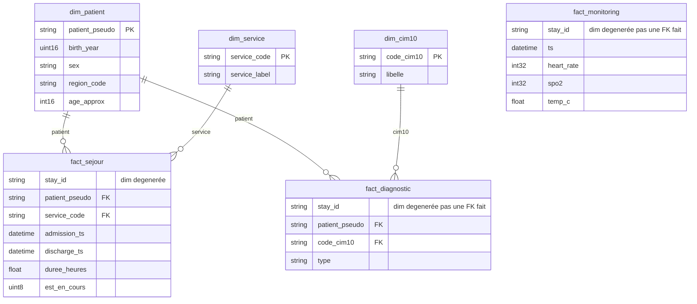

# Modèle de données — couche Silver

Modèle **en étoile**. Règle du prof : **aucun lien entre les faits**. Un fait ne joint qu’à des **dimensions**. ClickHouse n’a pas de FK : le contrat est dans le SQL (`sql/03_silver.sql`).

## 1. Trois faits autonomes

Chaque fait a son grain et **toutes les clés de dimensions** dont ses KPI ont besoin. On ne fait jamais `fact_* JOIN fact_*` en gold.

| Table | Type | Grain | Suffisant pour |
|---|---|---|---|
| `fact_sejour` | Fait | 1 passage | DMS, urgences / jour, réadmission 30 j, pyramide âge × sexe |
| `fact_diagnostic` | Fait | 1 code CIM-10 posé | Prévalence par pathologie |
| `fact_monitoring` | Fait | 1 relevé de constantes | Relevés en alerte / jour |
| `dim_patient` | Dimension | 1 patient | âge, sexe (join depuis `fact_sejour`) |
| `dim_service` | Dimension | 1 service | libellé (join depuis `fact_sejour`) |
| `dim_cim10` | Dimension | 1 code | libellé (join depuis `fact_diagnostic`) |
| `rejets` | Quarantaine | 1 ligne écartée | aucun KPI |

`stay_id` sur diagnostic et monitoring n’est **pas** une FK vers `fact_sejour`. C’est une **dimension dégénérée** (identifiant recopié, sans table de dimension).

Pourquoi le diagnostic est un fait : un séjour a plusieurs codes — c’est un événement de codage, pas un attribut du séjour.

Les trois faits **ne se touchent pas**. `patient_pseudo` est recopié **à l’ETL** depuis `bronze.sejours` vers `fact_diagnostic` : même clé conforme, pas un join gold entre faits.

`fact_monitoring` ne porte même pas le patient : le KPI « alertes / jour » n’a besoin que de l’horodatage et des constantes.

## 2. Un fait = une famille d’indicateurs (§4)

| Indicateur | Fait **seul** | Dimension(s) |
|---|---|---|
| DMS par service | `fact_sejour` | `dim_service` |
| Passages urgences / jour | `fact_sejour` | — |
| Réadmission 30 j | `fact_sejour` (auto-jointure du **même** fait) | `dim_service` |
| Relevés en alerte / jour | `fact_monitoring` | — |
| Prévalence par pathologie | `fact_diagnostic` | `dim_cim10` |
| Distribution âge × sexe | `fact_sejour` | `dim_patient` |

L’auto-jointure de `fact_sejour` pour la réadmission n’est pas un lien entre deux faits différents : on compare deux **lignes du même grain**.

## 3. Mesures

| Fait | Mesures |
|---|---|
| Séjour | `duree_heures`, `est_en_cours`, horodatages, modes |
| Diagnostic | `type` (principal / associé) — *factless fact* + `patient_pseudo` pour compter la cohorte |
| Monitoring | `heart_rate`, `spo2`, `temp_c` |

## 4. Construction (depuis bronze, indépendamment)

Chaque fait se charge depuis **ses** fichiers bronze. La règle « séjour dates inversées » est **recopiée** côté diagnostic (filtre sur `bronze.sejours`), on n’attend pas que `fact_sejour` existe.

| Contrat | Effet |
|---|---|
| Dump patients dédupliqué | `dim_patient` |
| Sortie vide | `fact_sejour.est_en_cours = 1` |
| Sortie avant entrée | absent de `fact_sejour` **et** de `fact_diagnostic` (même règle, deux pipelines) |
| Constante hors plage | absent de `fact_monitoring` |

## 5. Limites

- Pas de FK ClickHouse.
- `stay_id` commun n’autorise pas un `JOIN` gold fact–fact : si un usage futur voulait « constantes du séjour CIM-10 I21 », il faudrait soit dénormaliser davantage à l’ETL, soit un bus d’événements — pas un lien entre faits.
- `rejets` peut citer un `stay_id` absent d’un fait : normal.
