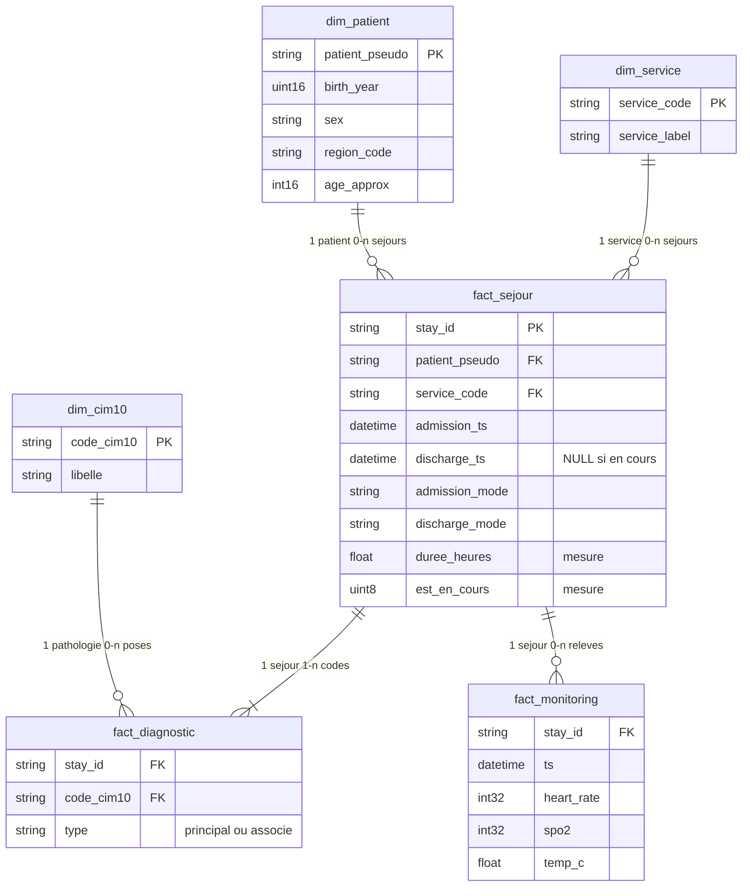

# Modèle de données — couche Silver

Modèle **en étoile**, calé sur le besoin métier (§4 du sujet). ClickHouse n’a pas de clés étrangères : le modèle est **logique**. Le SQL (`sql/03_silver.sql`) l’applique à chaque rebuild.

## 1. Trois faits, trois dimensions

Le séjour n’est plus « le tout-en-un ». Chaque fait a **un grain**, et les libellés vivent dans des **dimensions**.

| Table | Type | Grain (1 ligne =) |
|---|---|---|
| `fact_sejour` | **Fait** | 1 passage à l’hôpital |
| `fact_diagnostic` | **Fait** | 1 code CIM-10 posé sur un séjour |
| `fact_monitoring` | **Fait** | 1 relevé de constantes au chevet |
| `dim_patient` | Dimension | 1 patient pseudonymisé |
| `dim_service` | Dimension | 1 service d’hospitalisation |
| `dim_cim10` | Dimension | 1 code de pathologie |
| `rejets` | Hors modèle d’analyse | 1 ligne écartée + la règle |

Pourquoi le diagnostic est un **fait** et pas une dimension ? Parce qu’un séjour porte **plusieurs** codes (1 principal + 0..n associés) : c’est un événement de codage, pas un attribut du séjour.

On **ne dénormalise plus** l’âge ou le libellé CIM-10 dans les faits. Gold joint la dimension au moment de l’agrégat.

## 2. Lien avec le §4 (un fait par famille d’indicateurs)

| Indicateur du sujet | Fait lu | Dimensions |
|---|---|---|
| DMS par service | `fact_sejour` (sortis) | `dim_service` |
| Passages urgences / jour | `fact_sejour` (`service_code = URGENCES`) | — |
| Réadmission 30 jours | `fact_sejour` (auto-jointure patient) | `dim_service` |
| Relevés en alerte / jour | `fact_monitoring` | — |
| Prévalence par pathologie | `fact_diagnostic` (type principal) | `dim_cim10`, via `fact_sejour` pour le patient |
| Distribution âge × sexe | `fact_sejour` ⋈ `dim_patient` | `dim_patient` |

`rejets` n’alimente **aucun** KPI. C’est la quarantaine (qualité / traçabilité), pas un 4ᵉ fait métier.

## 3. Mesures portées par les faits

| Fait | Mesures / attributs de fait |
|---|---|
| Séjour | `duree_heures`, `est_en_cours`, modes d’entrée/sortie, horodatages |
| Diagnostic | `type` (principal / associé) — fait sans quantité, souvent appelé *factless fact* |
| Monitoring | `heart_rate`, `spo2`, `temp_c` |

`age_approx` est un attribut de **`dim_patient`**, calculé `année_courante − birth_year` (minimisation RGPD : pas de jour de naissance).

## 4. Contrôles qui fabriquent les faits

| Contrat | Où ça se voit |
|---|---|
| Dump patients dédupliqué | 1 ligne dans `dim_patient` |
| `discharge_ts` vide | `fact_sejour.est_en_cours = 1`, `duree_heures` NULL |
| Sortie avant entrée | **absent** de `fact_sejour`, dans `rejets` |
| Diagnostic d’un séjour rejeté | **absent** de `fact_diagnostic` |
| Constante hors 20–250 / 50–100 / 30–45 | **absent** de `fact_monitoring` |

## 5. Limites

- Pas de FK déclarée dans ClickHouse : l’intégrité est un contrat du pipeline.
- Le chemin patient pour un relevé est toujours **monitoring → séjour → patient**.
- `rejets.stay_id` peut ne plus exister dans `fact_sejour` : normal, on documente ce qui a été jeté.
