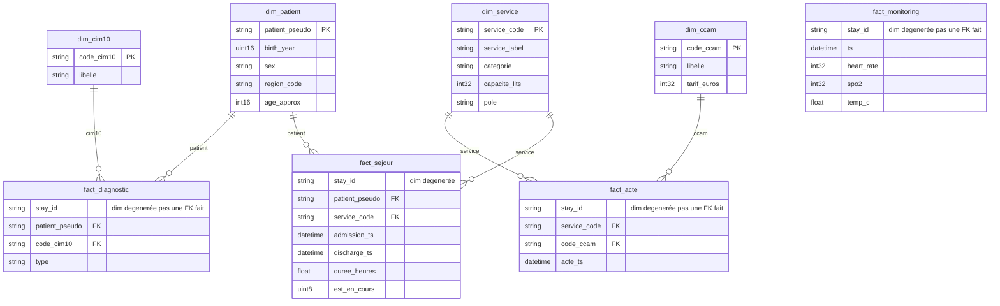

# Modèle de données — couche Silver

Modèle **en étoile**. Règle du prof : **aucun lien entre les faits**. Un fait ne joint qu’à des **dimensions**. ClickHouse n’a pas de FK : le contrat est dans le SQL (`sql/03_silver.sql`).

## 1. Quatre faits autonomes

Chaque fait a son grain et **toutes les clés de dimensions** dont ses KPI ont besoin. On ne fait jamais `fact_* JOIN fact_*` en gold.

| Table | Type | Grain | Suffisant pour |
|---|---|---|---|
| `fact_sejour` | Fait | 1 passage | DMS, urgences / jour, réadmission 30 j, DMS par **catégorie** |
| `fact_diagnostic` | Fait | 1 code CIM-10 posé | Prévalence, cohorte âge × sexe |
| `fact_monitoring` | Fait | 1 relevé de constantes | Relevés en alerte / jour |
| `fact_acte` | Fait | 1 acte CCAM | Actes / service, actes / type, densité / lit, T2A |
| `dim_patient` | Dimension | 1 patient | âge, sexe (join depuis `fact_diagnostic`) |
| `dim_service` | Dimension | 1 service | libellé, **catégorie**, **pôle**, **capacité** (hiérarchie) |
| `dim_cim10` | Dimension | 1 code | libellé (join depuis `fact_diagnostic`) |
| `dim_ccam` | Dimension | 1 acte | libellé, **tarif T2A** (join depuis `fact_acte`) |
| `rejets` | Quarantaine | 1 ligne écartée ou signalée | aucun KPI |

`stay_id` sur diagnostic, monitoring et acte n’est **pas** une FK vers `fact_sejour`. C’est une **dimension dégénérée** (identifiant recopié, sans table de dimension).

Pourquoi le diagnostic / l’acte sont des faits : un séjour a plusieurs codes et plusieurs actes — ce sont des **événements**, pas des attributs du séjour.

Les faits **ne se touchent pas**. `service_code` est recopié **à l’ETL** depuis `bronze.sejours` vers `fact_acte` : le gold fait `fact_acte ⋈ dim_service`, jamais `fact_acte ⋈ fact_sejour`.

`fact_monitoring` ne porte même pas le patient : le KPI « alertes / jour » n’a besoin que de l’horodatage et des constantes.

## 2. Hiérarchie de `dim_service`

Ce n’est pas une redondance : trois **niveaux d’agrégation** croissants.

| Niveau | Colonne | Grain |
|---|---|---|
| Le plus fin | `service_label` / `service_code` | 1 ligne = 1 service |
| Intermédiaire | `categorie` | plusieurs services (médecine, chirurgie, réanimation, urgences, pédiatrie) |
| Le plus large | `pole` | plusieurs catégories (Cœur-Poumon, Cancérologie…) |

`capacite_lits` est un attribut du service (plateau), pas une mesure de fait.

## 3. Deux pièges du dépôt 2026-08-29

### Service non décrit

`description_service.csv` a **7** lignes, `services.csv` en a **8**. **NEURO** n’a ni catégorie, ni lits, ni pôle.

Choix : on **conserve** NEURO dans `dim_service` (LEFT JOIN), attributs à **NULL**. On n’impute pas (« médecine » serait un mensonge). On **trace** (`rejets.service_sans_description`).

Pourquoi pas l’écarter : la DMS NEURO existe déjà, la non-régression l’interdit. En gold, la densité d’actes / lit **exclura** les capacités NULL (pas de division par 0 déguisée).

### Service de l’acte

L’acte n’a pas de `service_code`. Le service est celui du **séjour**. On le recopie à l’ETL depuis `bronze.sejours`, pas depuis `fact_sejour`.

## 4. Un fait = une famille d’indicateurs

| Indicateur | Fait **seul** | Dimension(s) |
|---|---|---|
| DMS par service | `fact_sejour` | `dim_service` |
| DMS / activité par catégorie | `fact_sejour` | `dim_service.categorie` |
| Passages urgences / jour | `fact_sejour` | — |
| Réadmission 30 j | `fact_sejour` (auto-jointure du **même** fait) | — |
| Relevés en alerte / jour | `fact_monitoring` | — |
| Prévalence par pathologie | `fact_diagnostic` | `dim_cim10` |
| Distribution âge × sexe | `fact_diagnostic` | `dim_patient` |
| Actes par service ; moy. / séjour | `fact_acte` | `dim_service` |
| Actes par type | `fact_acte` | `dim_ccam` |
| Densité actes / lit | `fact_acte` | `dim_service.capacite_lits` |
| Montant T2A / service | `fact_acte` | `dim_service` + `dim_ccam.tarif_euros` |

L’auto-jointure de `fact_sejour` pour la réadmission n’est pas un lien entre deux faits différents : on compare deux **lignes du même grain**.

## 5. Mesures

| Fait | Mesures |
|---|---|
| Séjour | `duree_heures`, `est_en_cours`, horodatages, modes |
| Diagnostic | `type` (principal / associé) — *factless fact* + `patient_pseudo` pour compter la cohorte |
| Monitoring | `heart_rate`, `spo2`, `temp_c` |
| Acte | `acte_ts` — *factless* ; le tarif vit dans `dim_ccam` |

## 6. Construction (depuis bronze, indépendamment)

Chaque fait se charge depuis **ses** fichiers bronze. Un séjour aux dates inversées est absent de `fact_sejour` ; son **codage** et ses **actes** restent (faits indépendants).

| Contrat | Effet |
|---|---|
| Dump patients dédupliqué | `dim_patient` |
| Sortie vide | `fact_sejour.est_en_cours = 1` |
| Sortie avant entrée | absent de `fact_sejour` ; diagnostic **et** acte du séjour **restent** |
| Constante hors plage | absent de `fact_monitoring` |
| Description de service absente | service **conservé**, attributs NULL, ligne dans `rejets` |
| Acte sans séjour | écarté (`sejour_introuvable`) |

## 7. Limites

- Pas de FK ClickHouse.
- `stay_id` commun n’autorise pas un `JOIN` gold fact–fact.
- `rejets` peut citer un `stay_id` absent d’un fait : normal.
- « Moyenne d’actes par séjour » calculée sur `fact_acte` = moyenne parmi les séjours **qui ont au moins un acte** (les séjours sans acte n’apparaissent pas sur ce fait).
