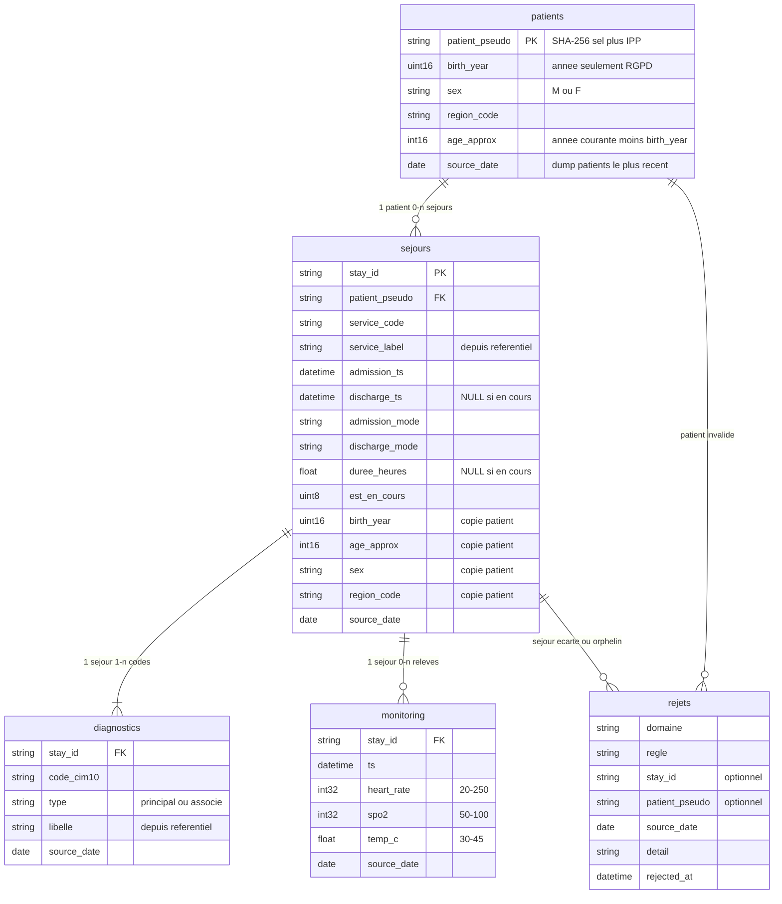
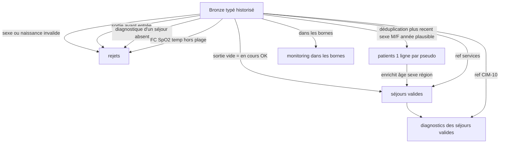

# Modèle de données — couche Silver

Ce document dit **ce que Silver doit être**, avant de regarder le SQL. ClickHouse n’a pas de clés étrangères : le modèle est **logique**. Les contraintes sont appliquées à la reconstruction (`sql/03_silver.sql`), pas par le moteur.

Silver = **table de vérité métier** : nettoyée, dédupliquée, enrichie, sans identité. Gold ne fait qu’agréger à partir d’ici.

## 1. Intention

On veut un modèle en étoile **autour du séjour** (fait hospitalier), pas un clone des fichiers CHU.

| Entité | Grain (1 ligne =) | Rôle |
|---|---|---|
| `patients` | 1 patient pseudonymisé | Dimension personne (minimisée) |
| `sejours` | 1 passage à l’hôpital | Fait central |
| `diagnostics` | 1 code CIM-10 d’un séjour | Dimension pathologie (plusieurs par séjour) |
| `monitoring` | 1 relevé de constantes | Fait de séries temporelles, rattaché au séjour |
| `rejets` | 1 ligne écartée + sa règle | Quarantaine / traçabilité, **hors** du modèle d’analyse |

Ce qu’on **ne** met pas en Silver comme tables séparées : `ref_services` et `ref_cim10`. Ce sont des nomenclatures bronze, **dénormalisées** dans `sejours.service_label` et `diagnostics.libelle`. En analytics, un join de plus à chaque KPI n’apporte rien une fois le libellé figé.

## 2. Schéma logique

Cardinalités visées :

- Un **patient** a 0..n séjours (un patient du dump peut n’avoir aucun passage sur la fenêtre).
- Un **séjour** a **au moins** un diagnostic principal dans les sources ; Silver ne garde que les diagnostics dont le séjour a passé les contrôles.
- Un **séjour** a 0..n relevés monitoring (pas tous les lits sont monitorés en continu dans l’exercice).
- **Rejets** n’entre dans aucun indicateur.

## 3. Clés et jointures

| Table | Clé métier | Jointure |
|---|---|---|
| `patients` | `patient_pseudo` | Hash déterministe du IPP, **stable** d’un jour à l’autre |
| `sejours` | `stay_id` | Identifiant CHU du passage, unique |
| `diagnostics` | `(stay_id, type, code_cim10)` | Un même code peut être principal **ou** associé, pas les deux sur un séjour dans nos sources |
| `monitoring` | `(stay_id, ts)` | Un relevé = un instant pour un séjour |
| `rejets` | pas de clé métier | Journal, pas une dimension |

Il n’y a **plus** d’IPP, NIR, nom, prénom. Les jointures patients ↔ séjours passent uniquement par `patient_pseudo`.

## 4. Pourquoi dénormaliser le patient dans `sejours` ?

Gold calcule DMS, réadmission, cohortes âge × sexe **à partir des séjours**. Recopier `sex`, `age_approx`, `birth_year`, `region_code` sur le séjour évite un join à chaque KPI.

Ce n’est pas une 3NF de DPI. C’est un **modèle analytique** : on paie un peu de redondance pour des agrégats simples et reproductibles.

`patients` reste utile : déduplication du dump quotidien, et point unique si demain on ajoute une vue « file active des patients connus » sans passer par les séjours.

## 5. Règles qui **fabriquent** ce modèle

Silver n’est pas « bronze avec des types ». Une ligne n’entre que si elle respecte le contrat ci-dessous.

| Contrat | Traduction dans le modèle |
|---|---|
| 1 patient = 1 ligne | `patients` dédupliqué sur `patient_pseudo` |
| Séjour en cours légitime | `discharge_ts` NULL, `est_en_cours = 1`, `duree_heures` NULL |
| Séjour incohérent | **absent** de `sejours`, présent dans `rejets` |
| Diagnostic d’un séjour rejeté | **absent** de `diagnostics` (intégrité référentielle logique) |
| Constante non physiologique | **absente** de `monitoring` |
| Pas d’identité | aucune colonne nominative |

## 6. Colonnes calculées (pas dans les fichiers)

| Colonne | Table | Formule / règle |
|---|---|---|
| `age_approx` | patients, sejours | `année_courante − birth_year` |
| `duree_heures` | sejours | `(discharge_ts − admission_ts)` en heures, NULL si en cours |
| `est_en_cours` | sejours | 1 ssi `discharge_ts` IS NULL |
| `service_label` | sejours | lookup `ref_services` |
| `libelle` | diagnostics | lookup `ref_cim10` |
| `patient_pseudo` | patients, sejours | déjà calculé **à l’entrée du lake** |

## 7. Ce que Gold a le droit de lire

Uniquement Silver « propre » (`patients`, `sejours`, `diagnostics`, `monitoring`).

- Pilotage : agrégats sur `sejours` et `monitoring` (DMS, urgences, réadmission, alertes). `rejets` n’est exposé en gold pilotage que **compté** (qualité), jamais ligne à ligne.
- Recherche : `diagnostics` type `principal` ⋈ `sejours`, puis `HAVING n ≥ 5`.

Si un chiffre gold n’est pas rejouable par un `SELECT` sur ces tables, le modèle est faux.

## 8. Limites du modèle

- Pas de contrainte d’unicité déclarée dans ClickHouse : l’unicité est un **contrat du pipeline** (rebuild).
- `age_approx` n’est pas un âge civil (minimisation RGPD).
- Monitoring n’est pas rattaché au patient directement : le chemin est toujours **relevé → séjour → patient**.
- `rejets` peut pointer un `stay_id` qui n’existe plus en `sejours` : c’est voulu (on documente ce qu’on a jeté).
