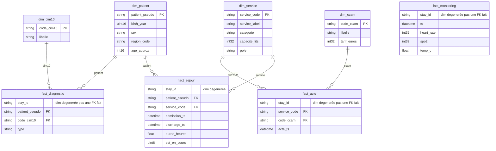
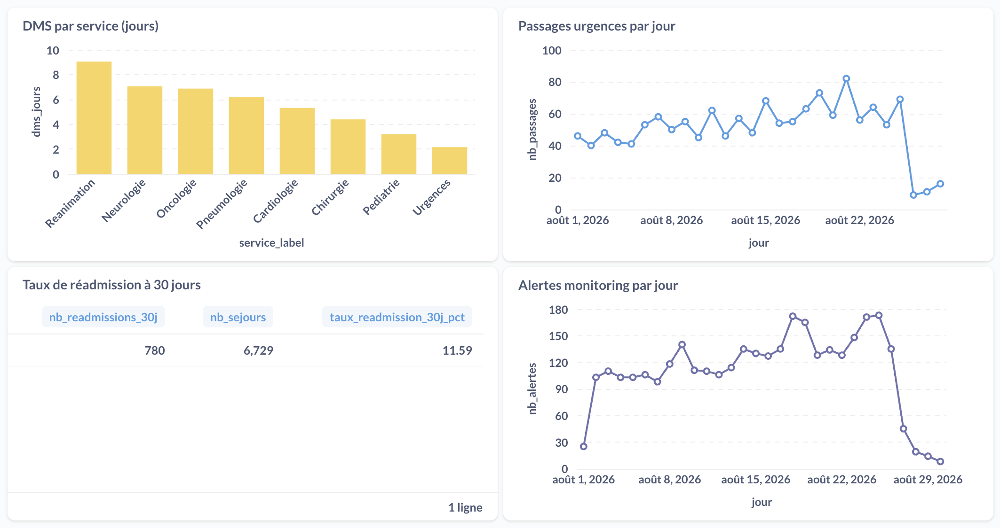
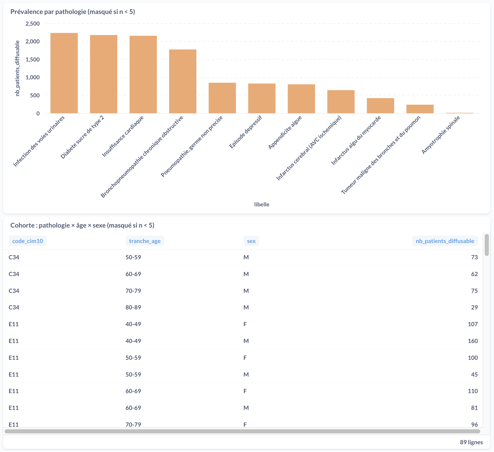
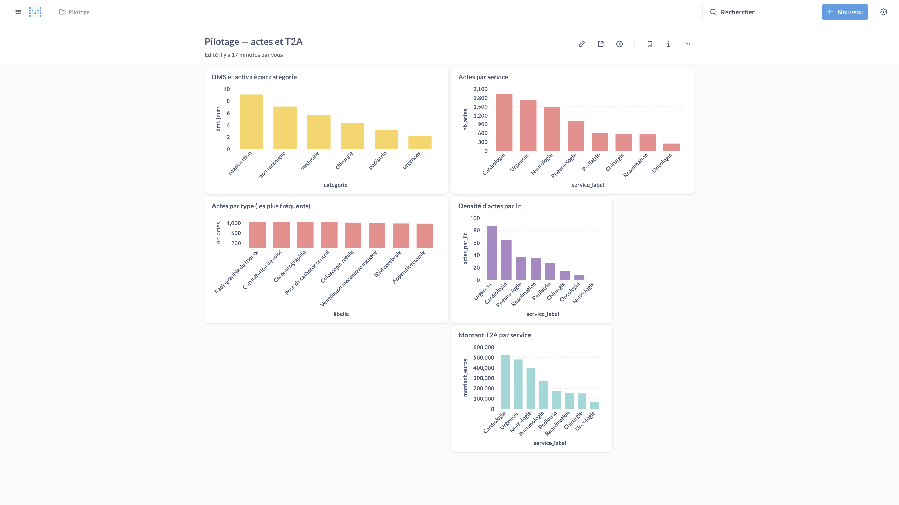

# Entrepôt de Données de Santé (EDS) — CHU

**Rapport de projet** — fil rouge Big Data (M2).

Les données hospitalières arrivent chaque jour dans un filestorage hétérogène (CSV, JSON, Parquet). Ce dépôt construit un EDS en architecture **médaillon** (lake → bronze → silver → gold), pour deux usages cloisonnés : le **pilotage hospitalier** et la **recherche clinique**.

Le présent document est le **rendu écrit** du projet. Il couvre la partie 1 (conception, modèle, indicateurs) et la partie 2 (pipeline, droits, exploitation). Les formules SQL sont dans `sql/04_gold.sql` ; chaque chiffre des dashboards se retrouve au `clickhouse-client`.

**Périmètre des chiffres.** Du 1er au 29 août 2026. 6 000 patients silver, 6 729 séjours, 40 920 relevés de constantes, 8 112 actes. Jeu d'exercice : les écarts de structure sont reproductibles dans ClickHouse ; ils ne constituent pas une épidémiologie de terrain.

## Table des matières

1. [Contexte et analyse du besoin](#1-contexte-et-analyse-du-besoin)
2. [Justification du projet](#2-justification-du-projet)
3. [Prérequis](#3-prérequis)
4. [Livrables](#4-livrables)
5. [Sources - ce que le CHU dépose](#5-sources--ce-que-le-chu-dépose) (dont [dictionnaire](#51-dictionnaire-de-données-colonnes-du-filestorage))
6. [Architecture médaillon - pourquoi ces couches](#6-architecture-médaillon--pourquoi-ces-couches)
7. [Choix de stack (et ce qu'on écarte)](#7-choix-de-stack-et-ce-quon-écarte)
8. [RGPD - décisions de conception](#8-rgpd--décisions-de-conception)
9. [Traitements par couche](#9-traitements-par-couche)
10. [Modèle Silver - schéma en étoile](#10-modèle-silver--schéma-en-étoile)
11. [Qualité - on écarte, on ne « répare » pas](#11-qualité--on-écarte-on-ne--répare--pas)
12. [Rapport des indicateurs - partie I (sujet initial)](#12-rapport-des-indicateurs--partie-i-sujet-initial)
13. [Justification de l’évolution - partie II (2026-08-29)](#13-justification-de-lévolution--partie-ii-2026-08-29)
14. [Cloisonnement des droits](#14-cloisonnement-des-droits)
15. [Pipeline incrémental](#15-pipeline-incrémental)
16. [Automatisation (scheduler)](#16-automatisation-scheduler)
17. [Journaux et traçabilité](#17-journaux-et-traçabilité)
18. [Exploitation - lancement et commandes](#18-exploitation--lancement-et-commandes)
19. [Reprise sur incident](#19-reprise-sur-incident)
20. [Volumes obtenus](#20-volumes-obtenus)
21. [Structure du dépôt](#21-structure-du-dépôt)
22. [Limites et recommandations](#22-limites-et-recommandations)

---

<a id="1-contexte-et-analyse-du-besoin"></a>
## 1. Contexte et analyse du besoin

Le CHU veut **centraliser** des exports quotidiens aujourd'hui éparpillés (dossier patient, urgences, diagnostics, monitoring des chambres), pour deux usages :

1. **Pilotage hospitalier** (direction, DIM) : activité, durées de séjour, urgences, qualité des soins (réadmissions), surveillance des constantes.
2. **Recherche clinique** : tailles de cohortes par pathologie, description (âge, sexe).

| Public | Question type | Données visibles |
|---|---|---|
| Direction / DIM | Combien de lits, quelle DMS, quelles urgences, quelle qualité (réadmissions, alertes) ? | Activité agrégée, **pas** de pathologie individuelle |
| Recherche clinique | Quelle taille de cohorte pour tel diagnostic ? Quelle structure d'âge / sexe ? | Cohortes agrégées, **jamais** d'identité, **jamais** un effectif &lt; 5 |

**Contrainte transverse** : les données de santé sont une catégorie particulière (RGPD art. 9). La conformité n'est pas un chapitre collé à la fin : elle contraint **chaque couche** (ce qu'on copie, ce qu'on stocke, qui voit quoi).

Ce que l'hôpital n'a pas demandé, et que nous ne livrons pas : un DPI, un outil de prescription, un identifiant nominatif pour le clinicien de terrain. L'EDS est un entrepôt **secondaire**.

---

<a id="2-justification-du-projet"></a>
## 2. Justification du projet

Le sujet n'est pas « mettre des fichiers dans une base ». C'est construire un **entrepôt secondaire** qui reste juste quand les fichiers arrivent tous les jours, quand un flux nouveau apparaît (29 août), et quand deux publics ne doivent **jamais** voir les mêmes tables.

### 2.1 Problème à résoudre

| Contrainte du CHU | Si on l'ignore | Décision prise |
|---|---|---|
| Formats hétérogènes, dépôt quotidien | Rejeu manuel, doublons, KPI instables | Médaillon + watermark `eds_ops.fichiers_traites` |
| Identité dans `patients.csv` (NIR, nom, IPP) | Données art. 9 sur le disque de travail | Pseudonymisation **à l'entrée du lake** (bonus) |
| Deux usages (DIM vs recherche) | Un dashboard avec un filtre | Deux gold, deux users SQL, deux collections |
| On n'est pas médecins | « Corriger » une FC à 15 ou une date inversée | Écarter + tracer dans `rejets` |
| Volume Parquet (monitoring, actes) | Lire les fichiers hors du moteur | `file(..., Parquet)` dans ClickHouse |
| Dépôt incomplet le 29 (NEURO absent) | Imputer une catégorie / des lits | NULL + rejet `service_sans_description` |
| L'acte n'a pas de service | Joindre deux faits en gold | Recopie `service_code` à l'ETL depuis bronze |

### 2.2 Pourquoi un médaillon (et pas une base unique)

Bronze reste **proche du fichier** (typage, provenance). Silver porte la **qualité et le modèle** (étoile, 4 faits sans lien). Gold porte les **phrases du besoin** déjà agrégées. Si la borne FC change, on reconstruit silver/gold **sans** relire 28 Parquet. Si le DIM veut un nouveau graphe, on ajoute une table gold, on ne touche pas au lake.

**Python orchestre, ClickHouse transforme.** L'ingestion bronze se fait par `file()` dans le moteur (CSV, JSONEachRow, Parquet). Qualité, étoile silver et KPI gold sont du SQL (`sql/03_silver.sql`, `sql/04_gold.sql`). Python recopie le lake, hashe l'IPP à l'entrée (stdlib `csv` / `hashlib`, ligne à ligne), envoie le SQL et journalise.

### 2.3 Pourquoi ces indicateurs (et pas d'autres)

Le §4 du sujet initial fixe **six** KPI, plus « toute autre vue d'activité pertinente ». L'évolution du 29 août en ajoute **cinq** (pas un sixième par pôle : `pole` est dans la dimension, pas dans un KPI demandé). Chaque graphe Metabase correspond à une phrase du besoin. Le détail est aux [§12](#12-rapport-des-indicateurs--partie-i-sujet-initial) et [§13](#13-justification-de-lévolution--partie-ii-2026-08-29).

| Partie | Dashboards | KPI |
|---|---|---|
| **I - sujet initial** | Pilotage hospitalier + Recherche clinique | DMS / service, urgences / jour (+ présents encore / durée), réadmission 30 j, alertes / jour, prévalence, cohorte âge × sexe |
| **II - évolution** | Pilotage - actes et T2A (**ajouté**, le premier n'est pas modifié) | DMS / catégorie, actes / service, actes / type, densité / lit, T2A / service |

Non-régression constatée après le 29 : DMS réa toujours **9,05 j**, réadmission toujours **11,59 %**, N39 toujours **2 234**.

### 2.4 Décisions structurantes

1. **Lake déjà pseudonymisé** - le filestorage CHU reste brut ; notre copie de travail n'a plus NIR / nom / prénom.
2. **Pas de jointure fait–fait** - un KPI = un fait ⋈ dimensions (sauf auto-jointure du *même* `fact_sejour` pour la réadmission).
3. **Deux gold + GRANT** - le cloisonnement est un refus SQL, pas un onglet caché.
4. **n < 5 masqué** en recherche - E84 (4) et Q90 (3) restent dans la table gold (contrôle) ; ils sont absents du graphe diffusé.
5. **Évolution incrémentale** - bronze s'append ; `dim_service` s'enrichit en LEFT JOIN ; NEURO n'est pas écarté (sinon la DMS neurologie de la partie I disparaît).

---

<a id="3-prérequis"></a>
## 3. Prérequis

Tout se lance depuis le dossier `rendu/`. Docker suffit pour ClickHouse, Metabase et le pipeline. Python sur l'hôte n'est nécessaire que pour `setup_metabase.py` ou un run local.

### 3.1 Machine

| Besoin | Minimum conseillé | Pourquoi |
|---|---|---|
| OS | macOS, Linux, ou Windows + Docker Desktop | Compose v2 ; chemins POSIX dans la doc |
| RAM | **4 Go** libres (8 Go confort) | ClickHouse + Metabase (JVM) en parallèle |
| Disque | **~3 Go** | Images Docker + volumes + `lake/` (copie du filestorage) |
| CPU | 2 cœurs | Ingestion Parquet + rebuild silver/gold |
| Ports **libres** | `8123`, `9000` (ClickHouse), `3000` (Metabase) | Sinon `up` échoue au bind |

Premier `docker compose up` : accès réseau pour tirer `clickhouse/clickhouse-server:24.8`, `metabase/metabase:v0.55.10`, et construire l'image `python:3.12-slim`.

### 3.2 Logiciels obligatoires (runtime EDS)

| Logiciel | Version visée | Rôle |
|---|---|---|
| **Docker Engine** + **Compose v2** | Compose plugin (`docker compose`, pas `docker-compose` v1) | Runtime ClickHouse, Metabase, pipeline, scheduler |
| **Filestorage CHU** | Dossier `source-filestorage/` à la racine du rendu | Lecture seule : patients, séjours, diagnostics, monitoring, actes, référentiels |

Images pinées dans `docker-compose.yml` / `Dockerfile` :

- `clickhouse/clickhouse-server:24.8`
- `metabase/metabase:v0.55.10` (driver ClickHouse **intégré**, pas d'install jar)
- build local `python:3.12-slim` + `requirements.txt`

### 3.3 Configuration obligatoire

```bash
cp .env.example .env
# Renseigner EDS_PSEUDO_SALT une fois, puis ne plus le changer.
```

| Variable | Obligatoire | Commentaire |
|---|---|---|
| `EDS_PSEUDO_SALT` | Oui | Sel du hash SHA-256. Changer le sel **après** ingestion casse toutes les jointures `patient_pseudo` |
| `SOURCE_FILESTORAGE` | Oui | Défaut `./source-filestorage` |
| `LAKE_ROOT` | Oui | Défaut `./lake` (gitignoré) |
| Comptes ClickHouse / Metabase | Déjà dans `.env.example` | Suffisants pour le rendu ; ne pas committer `.env` |

`.env` est gitignoré. Sans ce fichier, le pipeline Compose n'a pas le sel.

### 3.4 Optionnel - pipeline et Metabase depuis l'hôte

Utile pour `python scripts/setup_metabase.py` (le conteneur `pipeline` n'expose pas ce script comme commande par défaut) et pour itérer sans rebuild d'image.

| Logiciel | Version | Rôle |
|---|---|---|
| **Python** | 3.11+ (3.12 dans le Dockerfile) | Orchestrateur, provisionnement Metabase |
| `venv` | stdlib | Isoler `requirements.txt` |
| Paquets | `clickhouse-connect ≥ 0.8.0`, `python-dotenv ≥ 1.0.0`, `requests ≥ 2.31.0` | Client HTTP ClickHouse, `.env`, API Metabase |

```bash
python3 -m venv .venv && source .venv/bin/activate   # Windows : .venv\Scripts\activate
pip install -r requirements.txt
```

Côté hôte, `CLICKHOUSE_HOST=localhost` (déjà dans `.env.example`). Depuis un conteneur Compose, l'hôte ClickHouse est le nom de service `clickhouse`.

### 3.5 Optionnel — export PDF du présent rapport

**`pdflatex` n'est pas requis** (TeX Live n'est pas un prérequis du projet). Le rapport est ce fichier Markdown ; un PDF peut être produit ainsi :

| Logiciel | Rôle |
|---|---|
| **pandoc** 3.x | Markdown → PDF |
| **WeasyPrint** | Moteur PDF (`--pdf-engine=weasyprint`) |
| **Pango / GLib** (Homebrew sur macOS) | Bibliothèques natives WeasyPrint |
| `docs/justification-pdf.css` | Mise en page A4, tableaux, images |

```bash
export DYLD_FALLBACK_LIBRARY_PATH=/opt/homebrew/lib   # macOS Homebrew
pandoc rapport.md -o rapport.pdf --pdf-engine=weasyprint \
  --resource-path=. -V lang=fr --css=docs/justification-pdf.css \
  --syntax-highlighting=none
```

### 3.6 Ce qui n'est **pas** un prérequis

- Spark, Airflow, Prefect
- Client ClickHouse natif (`clickhouse-client`) - l'UI http://localhost:8123/play suffit
- Compte cloud, cluster, GPU
- Clé API Metabase - `scripts/setup_metabase.py` crée l'admin au premier lancement

### 3.7 Vérification rapide avant le premier run

```bash
docker compose version
test -d source-filestorage && test -f .env && echo "filestorage + .env OK"
```

Ports : rien ne doit déjà écouter sur 3000 / 8123 / 9000.

---

<a id="4-livrables"></a>
## 4. Livrables

| Partie | Ce qui est livré |
|---|---|
| **Partie 1 - Conception** | Chaîne lake → bronze → silver → gold, deux dashboards Metabase (+ un troisième d'évolution), cloisonnement des droits, le présent rapport |
| **Partie 2 - Exploitation** | Pipeline incrémental rejouable, scheduler automatisé, journalisation, gestion d'erreur, reprise sur incident |
| **Bonus** | Pseudonymisation **à l'entrée du lake** : aucune identité n'atteint ClickHouse |

---

<a id="5-sources--ce-que-le-chu-dépose"></a>
## 5. Sources - ce que le CHU dépose

Accès en **lecture seule** au filestorage CHU (`source-filestorage/`). On **copie** vers notre lake, on n'écrit jamais dans le dépôt CHU.

| Famille | Format | Volume observé | Rythme | Rôle |
|---|---|---|---|---|
| `patients/` | CSV | 3 dumps × 6 000 lignes | Complet (snapshots) | Identité + IPP. **PII** |
| `sejours/` | CSV | 6 797 lignes au total | Incrémental quotidien | Passage hospitalier |
| `diagnostics/` | JSON imbriqué | 1 fichier / jour | Quotidien | 1 principal + 0..n associés / séjour (CIM-10) |
| `monitoring/` | Parquet | 28 fichiers | Quotidien | Constantes au chevet. Volume (Big Data) |
| `actes/` | Parquet | 8 112 actes (dépôt **2026-08-29**) | Nouveau flux | Actes CCAM |
| `referentiels/` | CSV | J1 : services + CIM-10 ; **J29** : description_service + CCAM | Ponctuel | Libellés, hiérarchie, tarifs T2A |

Jours fournis : `2026-08-01` à `2026-08-29` (patients : 26–28 ; actes et description : le 29 seulement).

**Observations qui ont guidé le modèle** :

- Un patient revient tous les jours dans le dump → **déduplication** (on garde la version la plus récente).
- Un séjour `S00000006` a une sortie **antérieure** à l'entrée → anomalie à **écarter**, pas à « corriger ».
- `discharge_ts` vide = séjour en cours → **légitime**, on conserve.
- `patient_id`, `nir`, `nom`, `prenom` sont des identifiants directs → **interdits** dans l'entrepôt.
- Le dump patients ne change pas les attributs d'un IPP déjà vu (contrôle effectué J1 vs J3). On déduplique quand même : c'est la règle demandée, et elle restera juste le jour où un reverse administratif corrigera une date de naissance.
- Les 13 codes CIM-10 du référentiel sont ceux des diagnostics (dont E84, Q90, G12 : petits effectifs).

<a id="51-dictionnaire-de-données-colonnes-du-filestorage"></a>
### 5.1 Dictionnaire de données (colonnes du filestorage)

Repris de la fiche sujet et de la consigne d'évolution. **PII** = n'entre pas dans le lake / l'entrepôt.

**`patients.csv`** (identité réelle)

| Colonne | Type | Description | Dans l'entrepôt |
|---|---|---|---|
| `patient_id` | texte | IPP, clé de jointure avec les séjours | Hashé → `patient_pseudo` |
| `nir` | texte | N° de sécurité sociale | **Supprimé** |
| `nom` | texte | Nom | **Supprimé** |
| `prenom` | texte | Prénom | **Supprimé** |
| `birth_date` | date | Date de naissance complète | Généralisée → `birth_year` |
| `sex` | texte | M / F | Conservé, normalisé |
| `region_code` | texte | Département de résidence | Conservé (grain géographique possible ; aucun KPI gold actuel ne l'agrège) |

**`sejours.csv`** (un séjour = un passage)

| Colonne | Type | Description |
|---|---|---|
| `stay_id` | texte | Identifiant du séjour |
| `patient_id` | texte | Référence patient (hashée comme ci-dessus) |
| `service_code` | texte | Service d'hospitalisation |
| `admission_ts` | horodatage | Entrée |
| `discharge_ts` | horodatage | Sortie ; vide = séjour en cours |
| `admission_mode` | texte | urgence, programme, mutation |
| `discharge_mode` | texte | domicile, mutation, transfert, deces… |

**`diagnostics.json`** — structure imbriquée : `stay_id` + liste `{ code_cim10, type }` (`principal` ou `associe`). Aplati en NDJSON à l'entrée du lake.

**`monitoring.parquet`**

| Colonne | Type |
|---|---|
| `stay_id` | texte |
| `ts` | horodatage |
| `heart_rate` | entier (bpm) |
| `spo2` | entier (%) |
| `temp_c` | décimal (°C) |

**Référentiels J1** : `services.csv` (`service_code` → libellé), `cim10.csv` (code → libellé).

**Dépôt 2026-08-29**

| Fichier | Colonnes |
|---|---|
| `description_service.csv` | `service_code`, `categorie`, `capacite_lits`, `pole` |
| `ccam.csv` | `code_ccam`, `libelle`, `tarif_euros` |
| `actes.parquet` | `stay_id`, `code_ccam`, `acte_ts` (pas de `service_code` sur l'acte) |

---

<a id="6-architecture-médaillon--pourquoi-ces-couches"></a>
## 6. Architecture médaillon - pourquoi ces couches

```text
Filestorage CHU (lecture seule)
        │  Python : copie + pseudonymisation
        ▼
      Lake          ← fichiers de travail, déjà sans identité
        │  Python : INSERT / file()
        ▼
     Bronze         ← tables typées, peu transformées, historisées par jour
        │  SQL ClickHouse
        ▼
     Silver         ← nettoyé, dédupliqué, enrichi + table de rejets
        │  SQL ClickHouse
        ├──────────────────┐
        ▼                  ▼
 Gold Pilotage      Gold Recherche     ← KPI déjà agrégés, droits séparés
        │                  │
        └────────┬─────────┘
                 ▼
              Metabase
         (2 collections, 2 comptes)
```

| Couche | Rôle | Pourquoi elle existe |
|---|---|---|
| **Lake** | Copie de travail. Pour les patients / séjours : déjà pseudonymisée | Le CHU reste intouchable. Le bonus RGPD exige que l'identité **n'entre pas** dans notre zone |
| **Bronze** | Fichiers → tables typées (`Date`, `DateTime`, types numériques) + `_source_date` / `_ingested_at` | On peut **rejouer** silver/gold sans relire les fichiers. On sait d'où vient chaque ligne |
| **Silver** | Qualité + **4 faits autonomes** (séjour, diagnostic, monitoring, acte) + dimensions | Un fait ne joint **jamais** un autre fait, seulement des dimensions |
| **Gold** | Indicateurs **déjà agrégés**, un schéma par usage | Le dashboard ne recalcule pas la DMS. Le cloisonnement se fait ici (GRANT), pas dans l'UI seule |

**Décisions d'architecture** :

- **Lake ≠ copie bit-à-bit des patients.** Le sujet demande une « copie brute » *et* « aucune donnée identifiante dans l'entrepôt », tout en valorisant le bonus « à l'entrée du lake ». Le filestorage CHU reste brut ; **notre** lake est déjà pseudonymisé. Conserver NIR et nom sur le disque de travail du projet serait contraire à l'esprit RGPD du sujet.
- **Bronze peu transformé.** Typage + colonnes techniques `_source_date`, `_ingested_at`. Si la règle FC change, on reconstruit silver sans ré-ingérer.
- **Silver = vérité métier**, 4 faits **sans lien entre eux** (chacun ne joint qu'aux dimensions).
- **Deux gold.** Cloisonnement réel (GRANT SQL), pas un simple onglet Metabase.
- **Transformations dans ClickHouse.** Parquet, CSV et NDJSON sont lus par `file()`. Silver et gold sont du SQL dans le moteur.

**Python orchestre, ClickHouse transforme.** Le volume et les agrégations restent dans l'entrepôt colonne ; Python n'ouvre pas les Parquet.

---

<a id="7-choix-de-stack-et-ce-quon-écarte"></a>
## 7. Choix de stack (et ce qu'on écarte)

Le sujet propose une stack qui tient sur un laptop. Elle est retenue et justifiée ci-dessous.

| Brique | Rôle | Pourquoi |
|---|---|---|
| **ClickHouse 24.8** (Docker) | Entrepôt colonne | Parquet natif, SQL dans le moteur, UI `:8123/play`, agrégations très rapides |
| **Python 3.12** | Orchestrateur | Recopie lake, hash RGPD, dispatch SQL, logs (stdlib `csv` / `json` / `hashlib`) |
| **Metabase ≥ 0.55** (Docker, driver ClickHouse intégré) | Dashboards | Restitution sans code, collections et groupes pour le cloisonnement des droits |
| **Docker Compose** | Runtime | Un `up` suffit. Pas d'install ClickHouse divergente selon la machine |

**Hors périmètre (volontaire)** :

- **Spark** : disproportionné. Le volume (Parquet) et les agrégations restent dans ClickHouse.
- **Airflow / Prefect** - disproportionné pour un mois de fichiers et un laptop. Un scheduler Python + table de watermark fait l'incrémental et la reprise. En production on remplacerait ce scheduler par Airflow ; le SQL médaillon ne changerait pas.

**Dépendances Python** (`requirements.txt`) :

| Paquet | Usage |
|---|---|
| `clickhouse-connect ≥ 0.8.0` | Client HTTP natif vers ClickHouse |
| `python-dotenv ≥ 1.0.0` | Chargement du `.env` |
| `requests ≥ 2.31.0` | Script de provisionnement Metabase |

---

<a id="8-rgpd--décisions-de-conception"></a>
## 8. RGPD - décisions de conception

| Principe | Mise en œuvre |
|---|---|
| **Pseudonymisation à l'entrée** | `patient_id` → `SHA-256(sel \| IPP)` = `patient_pseudo` (stable). Sel dans `.env`, jamais dans git |
| **Minimisation** | `nir`, `nom`, `prenom` **supprimés** dès la copie. Date de naissance **généralisée à l'année** (`birth_year`). `region_code` est conservé (attribut patient, pas une mesure) mais **aucun KPI gold ne l'agrège** : on ne l'a pas inventé pour un graphe |
| **Cloisonnement** | 2 bases gold, 2 users ClickHouse (`pilotage` / `recherche`), 2 collections Metabase, 2 comptes applicatifs. Un `SELECT` SQL hors périmètre est refusé par ClickHouse, pas seulement caché dans l'UI |
| **Petits effectifs** | En recherche, `nb_patients_diffusable` est `NULL` si `nb_patients < 5` (la ligne reste, le chiffre n'est pas diffusé) |
| **Traçabilité** | `_source_date`, `_ingested_at`, table `eds_ops.fichiers_traites`, `eds_ops.runs`, table `eds_silver.rejets` (règle, séjour, jour source) |

Le hash est déterministe **avec sel** : sans le sel, on ne recompose pas l'IPP. Avec le même sel, le même patient a le même pseudo tous les jours → les jointures séjours/patients restent possibles.

Après anonymisation, on **perd** la possibilité de détecter une incohérence prénom/sexe : c'est le prix de la minimisation, noté en limite.

---

<a id="9-traitements-par-couche"></a>
## 9. Traitements par couche

### 9.1 Entrée du lake (pseudonymisation RGPD)

Sur `patients.csv` :

- `patient_id` → `SHA-256(sel | IPP)` = `patient_pseudo` (stable)
- `birth_date` → `birth_year` (généralisation)
- Suppression de `nir`, `nom`, `prenom`

Sur `sejours.csv` : même hash de `patient_id` pour conserver les jointures. `discharge_ts` vide → `\N` (NULL ClickHouse).

`diagnostics.json` → NDJSON aplati (`stay_id`, `code_cim10`, `type`) : changement de **format d'ingestion**, pas de règle métier.

Monitoring, actes et référentiels : copie telle quelle (pas de PII).

### 9.2 Bronze

Tables typées, partitionnées par `_source_date`. Chaque `INSERT` est un `SELECT … FROM file(...)` **exécuté par ClickHouse** (CSV, JSONEachRow, Parquet) : Python n'ouvre pas les Parquet. Ingestion **incrémentale** : un jour déjà `ok` n'est pas réinséré (`eds_ops.fichiers_traites`). `--force` droppe la partition du jour puis réinjecte.

| Table bronze | Engine | Partitionnement | Clé d'ordre |
|---|---|---|---|
| `patients` | MergeTree | `_source_date` | `(patient_pseudo, _source_date)` |
| `sejours` | MergeTree | `_source_date` | `stay_id` |
| `diagnostics` | MergeTree | `_source_date` | `stay_id` |
| `monitoring` | MergeTree | `_source_date` | `(stay_id, ts)` |
| `actes` | MergeTree | `_source_date` | `(stay_id, acte_ts)` |
| `ref_services` | ReplacingMergeTree | - | `service_code` |
| `ref_cim10` | ReplacingMergeTree | - | `code_cim10` |
| `ref_description_service` | ReplacingMergeTree | - | `service_code` |
| `ref_ccam` | ReplacingMergeTree | - | `code_ccam` |

Les référentiels utilisent `ReplacingMergeTree` pour ne garder que la version la plus récente (par `_ingested_at`).

### 9.3 Silver - contrôles et enrichissements

Rebuild **SQL** complet depuis bronze à chaque run (volume faible, idempotent, règles qualité toujours à jour). Aucune de ces règles n'est appliquée en Python.

| Règle | Action | Table de rejets |
|---|---|---|
| Doublons patients | `row_number()` par pseudo, on garde `_source_date` max | - |
| Sexe ∉ {M,F} ou année aberrante | écarté | `sexe_ou_naissance_invalide` |
| `discharge_ts < admission_ts` | écarté | `discharge_avant_admission` |
| `discharge_ts` NULL | **conservé**, `est_en_cours = 1` | - |
| FC ∉ [20,250], SpO2 ∉ [50,100], temp ∉ [30,45] | écarté | `valeur_hors_plage` |
| Diagnostic d'un séjour aux dates inversées | **conservé** dans `fact_diagnostic` | - |
| Service sans ligne dans `description_service` | **conservé** dans `dim_service`, attributs NULL | `service_sans_description` |
| Acte sans séjour | écarté | `sejour_introuvable` |
| Acte d'un séjour aux dates inversées | **conservé** dans `fact_acte` | - |

On **n'impute pas** une date de sortie, on ne « corrige » pas une FC à 15 bpm, on n'invente pas une catégorie pour NEURO. On n'est pas médecins.

`discharge_mode` vide sur un séjour **sorti** : hors liste imposée, **conservé**. Signalé ici comme dette qualité (export incomplet), pas comme rejet silencieux.

**Enrichissements** : `duree_heures` et `est_en_cours` sur le **fait séjour** ; `age_approx` sur **`dim_patient`** ; `service_code` recopié sur **`fact_acte`** depuis `bronze.sejours` (jamais depuis `fact_sejour`). Les libellés, tarifs et la hiérarchie restent dans les dimensions.

### 9.4 Gold

Rebuild SQL complet depuis silver à chaque run (`sql/04_gold.sql`). Droits ré-appliqués après `DROP TABLE` (ClickHouse retire les GRANT au drop). Metabase lit ces tables, il ne recalcule pas les KPI.

---

<a id="10-modèle-silver--schéma-en-étoile"></a>
## 10. Modèle Silver - schéma en étoile

Modèle **en étoile**. Règle : **aucun lien entre les faits**. Un fait ne joint qu'à des **dimensions**. ClickHouse n'a pas de FK : le contrat est dans le SQL (`sql/03_silver.sql`).

### 10.1 Quatre faits autonomes

Chaque fait a son grain et **toutes les clés de dimensions** dont ses KPI ont besoin. On ne fait jamais `fact_* JOIN fact_*` en gold.

| Table | Type | Grain | Suffisant pour |
|---|---|---|---|
| `fact_sejour` | Fait | 1 passage | DMS, urgences / jour, réadmission 30 j, DMS par catégorie |
| `fact_diagnostic` | Fait | 1 code CIM-10 posé | Prévalence, cohorte âge × sexe |
| `fact_monitoring` | Fait | 1 relevé de constantes | Relevés en alerte / jour |
| `fact_acte` | Fait | 1 acte CCAM | Actes / service, actes / type, densité / lit, T2A |
| `dim_patient` | Dimension | 1 patient | âge, sexe (join depuis `fact_diagnostic`) |
| `dim_service` | Dimension | 1 service | libellé, catégorie, pôle, capacité (hiérarchie) |
| `dim_cim10` | Dimension | 1 code | libellé (join depuis `fact_diagnostic`) |
| `dim_ccam` | Dimension | 1 acte | libellé, tarif T2A (join depuis `fact_acte`) |
| `rejets` | Quarantaine | 1 ligne écartée ou signalée | aucun KPI |

`stay_id` sur diagnostic, monitoring et acte n'est **pas** une FK vers `fact_sejour`. C'est une **dimension dégénérée** (identifiant recopié, sans table de dimension).

Pourquoi le diagnostic / l'acte sont des faits : un séjour a plusieurs codes et plusieurs actes - ce sont des **événements**, pas des attributs du séjour.

### 10.2 Diagramme entité-relation



Les faits **ne se touchent pas**. `service_code` est recopié **à l'ETL** depuis `bronze.sejours` vers `fact_acte` : le gold fait `fact_acte ⋈ dim_service`, jamais `fact_acte ⋈ fact_sejour`.

`fact_monitoring` ne porte même pas le patient : le KPI « alertes / jour » n'a besoin que de l'horodatage et des constantes.

### 10.3 Hiérarchie de `dim_service`

Ce n'est pas une redondance : trois **niveaux d'agrégation** croissants.

| Niveau | Colonne | Grain |
|---|---|---|
| Le plus fin | `service_label` / `service_code` | 1 ligne = 1 service |
| Intermédiaire | `categorie` | plusieurs services (médecine, chirurgie, réanimation, urgences, pédiatrie) |
| Le plus large | `pole` | plusieurs catégories (Cœur-Poumon, Cancérologie…) |

`capacite_lits` est un attribut du service (plateau), pas une mesure de fait.

**Pourquoi pas de KPI gold par pôle.** La consigne d'évolution demande de **compléter** `dim_service` (catégorie, lits, pôle) et liste **cinq** indicateurs. Aucun n'est « par pôle ». On charge `pole` (LEFT JOIN) pour que le grain existe demain (`GROUP BY pole` sans changer le modèle). On n'invente pas un sixième graphe : ce serait hors sujet, et NEURO n'a pas de pôle (NULL), le même piège 1 qu'en catégorie.

### 10.4 Deux pièges du dépôt 2026-08-29

**Service non décrit** : `description_service.csv` a **7** lignes, `services.csv` en a **8**. **NEURO** n'a ni catégorie, ni lits, ni pôle. Choix : on **conserve** NEURO dans `dim_service` (LEFT JOIN), attributs à **NULL**. On n'impute pas (« médecine » serait un mensonge). On **trace** (`rejets.service_sans_description`). Pourquoi ne pas l'écarter : la DMS NEURO existe déjà, la non-régression l'interdit.

**Service de l'acte** : l'acte n'a pas de `service_code`. Le service est celui du **séjour**. On le recopie à l'ETL depuis `bronze.sejours` (avec `GROUP BY stay_id` + `argMax(service_code, _ingested_at)`), jamais depuis `fact_sejour`. Cela proscrit toute jointure fait-à-fait.

### 10.5 Un fait = une famille d'indicateurs

| Indicateur | Fait **seul** | Dimension(s) |
|---|---|---|
| DMS par service | `fact_sejour` | `dim_service` |
| DMS / activité par catégorie | `fact_sejour` | `dim_service.categorie` |
| Passages urgences / jour | `fact_sejour` | - |
| Réadmission 30 j | `fact_sejour` (auto-jointure du **même** fait) | - |
| Relevés en alerte / jour | `fact_monitoring` | - |
| Prévalence par pathologie | `fact_diagnostic` | `dim_cim10` |
| Distribution âge × sexe | `fact_diagnostic` | `dim_patient` |
| Actes par service ; moy. / séjour | `fact_acte` | `dim_service` |
| Actes par type | `fact_acte` | `dim_ccam` |
| Densité actes / lit | `fact_acte` | `dim_service.capacite_lits` |
| Montant T2A / service | `fact_acte` | `dim_service` + `dim_ccam.tarif_euros` |

L'auto-jointure de `fact_sejour` pour la réadmission n'est pas un lien entre deux faits différents : on compare deux **lignes du même grain**.

### 10.6 Mesures

| Fait | Mesures |
|---|---|
| Séjour | `duree_heures`, `est_en_cours`, horodatages, modes |
| Diagnostic | `type` (principal / associé) - *factless fact* + `patient_pseudo` pour compter la cohorte |
| Monitoring | `heart_rate`, `spo2`, `temp_c` |
| Acte | `acte_ts` - *factless* ; le tarif vit dans `dim_ccam` |

### 10.7 Construction depuis bronze (indépendamment)

Chaque fait se charge depuis **ses** fichiers bronze. Un séjour aux dates inversées est absent de `fact_sejour` ; son **codage** et ses **actes** restent (faits indépendants).

| Contrat | Effet |
|---|---|
| Dump patients dédupliqué | `dim_patient` |
| Sortie vide | `fact_sejour.est_en_cours = 1` |
| Sortie avant entrée | absent de `fact_sejour` ; diagnostic **et** acte du séjour **restent** |
| Constante hors plage | absent de `fact_monitoring` |
| Description de service absente | service **conservé**, attributs NULL, ligne dans `rejets` |
| Acte sans séjour | écarté (`sejour_introuvable`) |

### 10.8 Limites du modèle

- Pas de FK ClickHouse : le contrat est le SQL silver/gold.
- `stay_id` commun n'autorise **pas** un `JOIN` gold fact–fact.
- `rejets` peut citer un `stay_id` absent d'un fait : normal.
- « Moyenne d'actes par séjour » calculée sur `fact_acte` = moyenne parmi les séjours **qui ont au moins un acte** (les séjours sans acte n'apparaissent pas sur ce fait).

---

<a id="11-qualité--on-écarte-on-ne--répare--pas"></a>
## 11. Qualité - on écarte, on ne « répare » pas

On n'est pas médecins. Le sujet demande de **détecter**, **écarter**, **tracer**. Exception unique : un séjour sans date de sortie n'est pas une erreur.

| Contrôle | Action |
|---|---|
| Doublons patients (dump quotidien) | Garder `_source_date` la plus récente |
| `discharge_ts < admission_ts` | Rejet `discharge_avant_admission` |
| `discharge_ts` vide | Conservé, `est_en_cours = 1` |
| FC hors 20–250, SpO2 hors 50–100, temp hors 30–45 °C | Rejet `valeur_hors_plage` |
| Sexe ∉ {M,F} ou année aberrante | Rejet `sexe_ou_naissance_invalide` |
| Service absent de `description_service.csv` | **Conservé** dans `dim_service`, attributs NULL ; tracé `service_sans_description` |
| Acte sans séjour | Rejet `sejour_introuvable` |

`discharge_mode` vide alors que le séjour est sorti existe dans les fichiers : ce n'est **pas** dans la liste des rejets imposés, on conserve la ligne et on le signale comme dette qualité.

Le dépôt du 29 août n'écrase pas `dim_service` : on **enrichit** (LEFT JOIN). NEURO reste, sans catégorie ni lits. Le `service_code` des actes est recopié depuis `bronze.sejours` à l'ETL - on ne joint jamais deux faits.

---

<a id="12-rapport-des-indicateurs--partie-i-sujet-initial"></a>
## 12. Rapport des indicateurs - partie I (sujet initial)

Le CHU veut un EDS pour **deux usages qui ne doivent pas se mélanger** : le pilotage hospitalier (direction, DIM) et la recherche clinique. Le §4 du sujet fixe six indicateurs. Nous n’en ajoutons aucun dans cette partie : chaque graphe correspond à une phrase du besoin.

Les formules SQL sont dans `sql/04_gold.sql`. Un chiffre du dashboard se retrouve au `clickhouse-client`. Le dashboard **lit le gold** : il ne recalcule pas la DMS en JavaScript.

### 12.1 Publics, cloisonnement, choix graphiques

| Public | Question | Dashboard Metabase | Données visibles |
|---|---|---|---|
| Direction / DIM | Comment tourne l’hôpital ? | **Pilotage hospitalier** | Activité agrégée, **pas** de pathologie individuelle |
| Recherche clinique | Quelles cohortes, pour qui ? | **Recherche clinique** | Effectifs par diagnostic, **jamais** n &lt; 5 diffusé |

Le cloisonnement n’est pas un onglet : deux schémas gold, deux users ClickHouse, deux collections. `pilotage` reçoit `ACCESS_DENIED` sur `eds_gold_recherche`. Inversement pour `recherche`. C’est la contrainte RGPD « droits d’accès distincts ».

**Règles de restitution :**

- **Barres** quand on compare des catégories (services, pathologie).
- **Courbe** quand l’ordre des jours compte (urgences, alertes).
- **Tableau** quand il n’y a qu’un taux, ou trois dimensions à la fois.
- **Pas de camembert** : l’œil compare mal les parts ; un petit effectif masqué y disparaîtrait.

Un graphe n’est pas décoratif : il encode **une** question, pour **un** public. On n’empile pas les deux usages sur le même dashboard.

### 12.2 Dashboard Pilotage hospitalier



*Figure 1 - Les quatre KPI de pilotage du §4.*

#### KPI 1 - Durée moyenne de séjour par service

**Ce que le sujet demande.** « Durée Moyenne de Séjour (DMS) par service ».

**Pourquoi cette restitution.** La DMS mesure la **rotation des lits**. Le DIM compare les services entre eux, pas « l’hôpital en un seul chiffre » (une moyenne unique noierait la réa dans les urgences). On ne retient que les séjours **sortis** : un séjour en cours n’a pas de `discharge_ts`, donc pas de durée. L’inclure imposerait d’inventer une date de fin - interdit par le sujet (on n’impute pas).

**Formule.** Pour chaque service, moyenne de `(sortie − entrée) / 24 h` sur `fact_sejour` où `est_en_cours = 0`, joint à `dim_service` pour le libellé. On publie aussi `dms_heures` (même moyenne, autre unité) et `nb_sejours` (sortis uniquement), pour que le taux soit opposable.

**Pourquoi des barres.** Huit modalités nominales, triées de la plus longue à la plus courte. Une courbe exigerait un axe temps. Un camembert comparerait des parts d’un total qui n’existe pas (on ne « répartit » pas 100 % d’une durée).

**Résultats.**

| Service | Séjours sortis | DMS (jours) | DMS (heures) |
|---|---|---|---|
| Réanimation | 423 | **9,05** | 217,1 |
| Neurologie | 1 077 | 7,06 | 169,5 |
| Oncologie | 185 | 6,87 | 164,8 |
| Pneumologie | 753 | 6,20 | 148,9 |
| Cardiologie | 1 459 | 5,31 | 127,5 |
| Chirurgie | 424 | 4,39 | 105,2 |
| Pédiatrie | 448 | 3,19 | 76,5 |
| Urgences | 1 277 | **2,15** | 51,7 |

**Interprétation.** L’ordre est **cliniquement cohérent**, pas un classement de performance. La réa garde des patients instables (~9 jours). Les urgences sont un passage (~2 jours). La cardio a le plus gros volume (1 459 sorties) avec une DMS intermédiaire : beaucoup de lits qui tournent, pas des séjours longs. L’onco a peu de séjours (185) mais une DMS élevée : séjour plus « lourd », effectif petit.

**Limite.** Un mois de données, beaucoup de séjours encore ouverts en fin de fenêtre : la DMS des services à séjour long (réa, neuro) est calculée **seulement sur ceux déjà sortis**. Ce n’est pas un biais que l’on « corrige » ; on le signale.

#### KPI 2 - Activité des urgences : passages par jour

**Ce que le sujet demande.** « Activité des urgences : passages par jour », plus « toute autre vue d'activité pertinente ».

**Pourquoi le service URGENCES, pas le mode d’admission.** `admission_mode = urgence` existe aussi en cardiologie (entrée non programmée dans un autre service). Le besoin DIM est la charge **du plateau urgences** : `service_code = 'URGENCES'`. On groupe par jour d’admission (`toDate(admission_ts)`).

**Vue d'activité en plus (phrase du §4).** Le graphe principal reste `nb_passages`. On publie aussi `nb_encore_presents` (séjours de ce jour **sans** `discharge_ts` à la fin de la fenêtre) et `duree_moy_heures` (moyenne sur les clos : `avg` ignore les NULL). Ce n'est pas un septième KPI inventé : c'est la lecture de fin de mois que le seul nombre de passages ne permet pas (un pic de « encore présents » dit que la fenêtre s'arrête, pas que le service sature).

**Pourquoi une courbe.** L’ordre des 28 jours compte. On cherche un pic, un creux, une rupture. Des barres quotidiennes marcheraient, mais la ligne lit mieux un **flux**.

**Résultats.** Montée progressive jusqu’à un pic vers le 21 août (~82 passages). Chute nette après le 25 : 9, 11 puis 16 passages les 26–28 août. `nb_encore_presents` est à 0 jusqu’au 15, puis non nul (des patients admis ces jours-là n’ont pas encore de sortie dans le dépôt).

**Interprétation.** La chute de fin août **n’est pas** « les urgences se vident ». C’est la **fin de la fenêtre d’ingestion** : moins de nouveaux fichiers, séjours encore ouverts. Confondre ça avec une tendance hospitalière serait une erreur de lecture. Le pic du 21 est un maximum **dans le mois simulé**, pas une épidémie démontrée. `nb_encore_presents` documente exactement cette limite.

#### KPI 3 - Taux de réadmission à 30 jours

**Ce que le sujet demande.** « Taux de réadmission à 30 jours (qualité des soins) ».

**Pourquoi un taux global, pas par service.** Le corrigé de niveau 1 donne un seul triplet : 780 réadmissions, 6 729 séjours, **11,59 %**. Découper par service inventerait un KPI que le sujet ne demande pas ici et casserait l’alignement. Le service du séjour index est une question DIM différente.

**Définition sortie.** Un séjour est une réadmission s’il existe un **autre** séjour du même `patient_pseudo`, **sorti**, tel que la nouvelle admission tombe dans `]sortie ; sortie + 30 j]`. Dénominateur = **tous** les séjours silver (y compris en cours). Numérateur = séjours qui *sont* une réadmission (pas « sorties suivies d’un retour », ce qui exclurait les en-cours du dénominateur et ne reproduirait pas 6 729).

**Pourquoi un tableau, pas un graphe.** Un seul chiffre. Une barre unique n’informe pas. Le tableau montre ensemble 780, 6 729 et 11,59 % : le taux n’est pas orphelin de son numérateur.

**Interprétation.** 11,59 % est **reproductible** et aligné sur le corrigé. Ce n’est **pas** un verdict de qualité annuelle : un patient sorti le 20 août n’a que 9 jours de recul, pas 30. Le taux est un **plancher** lié à la fenêtre. On le publie tel quel, avec cette limite, plutôt que d’inventer une correction.

#### KPI 4 - Relevés en alerte par jour

**Ce que le sujet demande.** « Surveillance des constantes : relevés en alerte / jour ».

**Pourquoi deux familles de seuils.** La fiche sujet ne donne que des bornes **qualité** (FC 20–250, SpO2 50–100, temp 30–45 °C) : hors plage → **rejet** en silver, pas une alerte. « Relevés en alerte » n'a pas de bornes dans la fiche. On les aligne sur le **corrigé de niveau 1** (jeu seed 42) et sur le sens clinique usuel d'une alerte de monitoring, **parmi les relevés déjà crédibles** : FC &lt; 50 ou &gt; 100, SpO2 &lt; 92, T° &gt; 38,5. Un SpO2 à 10 % n’alerte pas (il n’entre pas en `fact_monitoring`). Un SpO2 à 91 % alerte.

**Sortie gold.** Par jour : `nb_releves`, `nb_alertes`, `taux_alertes_pct`. Le graphe montre `nb_alertes` (volume de surveillance), le taux est dans la table pour expliquer les 29–30 août.

**Pourquoi une courbe.** Même logique que les urgences : série quotidienne, pics visibles.

**Résultats.** Après le 1er août (montée en charge, 351 relevés), le quotidien se situe vers 100–175 alertes, soit **environ 7–9 %** des relevés. Chute après le 26 (moins de monitoring). Les 29–30 août : 14 et 8 alertes mais **10,8 % et 23,5 %** - le taux explose parce que le **dénominateur** s’écroule, pas parce que les patients vont plus mal.

**Interprétation.** L’indicateur pilote la **charge de surveillance**, pas un score de gravité individuelle. La corrélation visuelle avec la courbe urgences en fin de mois a la même cause (fenêtre), pas un lien causal urgences → alertes (on ne joint pas les faits).

### 12.3 Dashboard Recherche clinique



*Figure 2 - Prévalence et cohorte. Diffusion RGPD : n &lt; 5 masqué.*

Le chercheur n’a **pas** la DMS ni les réadmissions. Il a des **tailles de cohortes**. Les petits effectifs : on ne diffuse pas si `nb_patients < 5` (seuil du sujet : *strictement inférieur à 5*, donc n = 5 est publié).

#### KPI 5 - Prévalence par pathologie

**Ce que le sujet demande.** « Prévalence par pathologie : taille des cohortes par diagnostic ».

**Pourquoi des patients distincts, tout code posé.** Une cohorte de recherche se compte en **personnes**, pas en lignes de diagnostic. Le corrigé (N39 = 2 234, E84 = 4, Q90 = 3) ne se reproduit que si l’on compte **principal et associé**, y compris les diagnostics d’un séjour aux dates inversées (le séjour est écarté de `fact_sejour`, pas le codage). Filtrer sur le seul principal sous-estimerait N39 d’un facteur ~2,5.

**Sortie gold.** `nb_patients` (effectif réel, pour contrôle) et `nb_patients_diffusable` (NULL si n &lt; 5). Le dashboard ne trace que `nb_patients_diffusable IS NOT NULL`.

**Pourquoi des barres.** Comparer 11 cohortes publiables, triées par taille. **Pas de barre à zéro** pour E84/Q90 : une barre vide dirait « cette maladie rare est dans l’EDS ».

**Résultats.**

| Code | Libellé | n | Diffusé |
|---|---|---|---|
| N39 | Infection des voies urinaires | 2 234 | 2 234 |
| E11 | Diabète sucré de type 2 | 2 177 | 2 177 |
| I50 | Insuffisance cardiaque | 2 156 | 2 156 |
| J44 | BPCO | 1 775 | 1 775 |
| J18 | Pneumopathie, germe non précisé | 850 | 850 |
| F32 | Épisode dépressif | 827 | 827 |
| K35 | Appendicite aiguë | 806 | 806 |
| I63 | Infarctus cérébral | 643 | 643 |
| I21 | Infarctus aigu du myocarde | 421 | 421 |
| C34 | Tumeur maligne bronches / poumon | 239 | 239 |
| G12 | Amyotrophie spinale | 8 | **8** (n ≥ 5) |
| E84 | Mucoviscidose | 4 | **masqué** |
| Q90 | Trisomie 21 | 3 | **masqué** |

**Interprétation.** Les trois premières cohortes (&gt; 2 000) sont des **comorbidités fréquentes** : beaucoup de patients ont N39/E11/I50 en associé, pas forcément comme motif d'entrée. G12 = 8 **est publié** : la règle est n &lt; 5, pas n &lt; 10. E84 et Q90 existent en gold (4 et 3, vérifiables par requête) mais **pas** sur le graphe. « Il n'y a pas de mucoviscidose dans l'EDS » serait faux : elle est masquée.

#### KPI 6 - Description de cohorte : âge × sexe

**Ce que le sujet demande.** « Description de cohorte : distribution par âge et sexe ».

**Pourquoi pathologie × tranche 10 ans × sexe, pas une pyramide unique.** Une pyramide 0–17 / 18–39… mélange toutes les maladies et ne sert pas à **constituer une cohorte**. Le corrigé est au grain (code CIM-10, tranche, sexe), diagnostic **principal** (sinon on recompterait les associés dans chaque maille). Tranches `0-9` … `90-99` : `2026 − birth_year` (minimisation : on n’a que l’année).

**Même masque RGPD.** Une maille de 1 ou 2 patients (E84, G12, Q90 par âge) n’est pas diffusée.

**Pourquoi un tableau.** Trois dimensions, ~90 lignes publiables. Un graphique groupé serait illisible. Le chercheur lit **une case**.

**Résultats (lecture, pas une étude).** C34 n’apparaît que chez les hommes, surtout 50–79 ans (73 / 62 / 75). E11 est mixte, pic hommes 40–49 ans (160). F32 (dépression) se concentre sur 20–49 ans. K35 (appendicite) est jeune / pédiatrique. K35 40–49 F = 7, encore diffusé. Les mailles E84/G12/Q90 à n = 1 ou 2 sont absentes du tableau Metabase.

**Interprétation.** La structure **ressemble** à la clinique de manuel (cancer bronchique masculin âgé, appendicite jeune). Ça **valide le pipeline**, ça ne **prouve** pas une population réelle. L’âge est une année civile : erreur jusqu’à 12 mois, assumée (minimisation RGPD).

### 12.4 Synthèse de la partie I

| KPI | Graphe | Résultat | Lecture juste | Lecture abusive |
|---|---|---|---|---|
| DMS / service | Barres | Réa 9,05 j ; urgences 2,15 j | Gradient clinique, dimensionnement | « La réa est inefficace » |
| Urgences / jour | Courbe | Pic ~82 le 21/08, chute après le 25 | Fenêtre d’ingestion ; `nb_encore_presents` = vue d’activité extra | « Les urgences se vident » |
| Réadmission 30 j | Tableau | **11,59 %** (780 / 6 729) | Aligné corrigé, plancher | Taux annuel de qualité |
| Alertes / jour | Courbe | ~7–9 % des relevés | Charge de surveillance (seuils d’alerte ≠ rejet) | Gravité individuelle |
| Prévalence | Barres | N39 = 2 234 ; E84/Q90 masqués | Cohortes + k-anonymat | « Pas de mucoviscidose » |
| Âge × sexe | Tableau | C34 masculin 50–79 ; E11 mixte | Description de cohorte | Inférence médicale |

Les quatre graphes de la figure 1 et les deux de la figure 2 **couvrent tout le §4**. La vue d'activité extra (`nb_encore_presents`, `duree_moy_heures`) est dans le gold urgences, pas un dashboard séparé.

---

<a id="13-justification-de-lévolution--partie-ii-2026-08-29"></a>
## 13. Justification de l’évolution - partie II (2026-08-29)

Le 29 août, le CHU **enrichit** l’EDS déjà en production : description plus fine des services (catégorie, lits, pôle), nomenclature CCAM, flux d’actes Parquet. Consigne : ingérer **sans retraiter** l’existant, **sans casser** les KPI de la partie I, et produire **cinq** indicateurs liés à ces nouveaux attributs.

### 13.1 Ce qui change dans le modèle (pour que les KPI existent)

On n’a pas refait l’entrepôt. Bronze s’**append** (nouveau domaine `actes`, deux nouveaux référentiels). Silver s’enrichit :

- `dim_service` : LEFT JOIN de la description → `categorie`, `capacite_lits`, `pole`.
- `dim_ccam` : code, libellé, `tarif_euros`.
- `fact_acte` : un acte = une ligne ; **`service_code` recopié à l’ETL depuis `bronze.sejours`**, jamais depuis `fact_sejour`.

Les faits restent **sans lien entre eux**. Gold d’évolution = `fact_acte ⋈ dim_service` et/ou `dim_ccam`, ou `fact_sejour ⋈ dim_service.categorie`.

**Non-régression constatée.** Après rebuild : DMS réa toujours **9,05 j**, réadmission toujours **11,59 %**, N39 toujours **2 234**. Le dashboard de la partie I n’a pas été modifié. Les nouveaux graphes sont un **second** dashboard Pilotage.

### 13.2 Les deux pièges - choix justifiés

#### Piège 1 - Référentiel de description incomplet

`description_service.csv` a **7** lignes, `services.csv` en a **8**. **NEURO** n’a ni catégorie, ni lits, ni pôle.

| Option | Décision | Pourquoi |
|---|---|---|
| Écarter NEURO de `dim_service` | **Non** | La DMS neurologie (7,06 j, 1 077 séjours) de la partie I disparaîtrait. Interdit par la non-régression. |
| Imputer « médecine » / un nombre de lits | **Non** | On n’est pas médecins ; le sujet dit d’écarter ou de tracer, pas d’inventer. |
| Conserver NEURO, attributs **NULL**, tracer | **Oui** | LEFT JOIN. Rejet `service_sans_description`. Gold : catégorie `non renseigne` ; densité **NULL** (pas 0) ; T2A **calculé** (le tarif est sur l’acte). |

#### Piège 2 - Le service de l’acte

L’acte n’a que `stay_id` + `code_ccam` + `acte_ts`. Le service est celui du **séjour**.

Joindre `fact_acte` à `fact_sejour` en gold violerait la règle « pas de lien entre faits ». On recopie `service_code` **à l’ETL** depuis `bronze.sejours`. Le gold ne voit qu’un fait autosuffisant.

Conséquence sur la moyenne d’actes / séjour : le dénominateur est `uniqExact(stay_id)` **dans `fact_acte`** (séjours qui ont **au moins un** acte). Les séjours sans acte n’y sont pas. Pour les compter, il faudrait le fait séjour - interdit. On assume et on l’écrit.

### 13.3 Dashboard « Pilotage - actes et T2A »



*Figure 3 - Cinq KPI d’évolution. Collection Pilotage (le chercheur ne les voit pas : ce n’est pas de la cohorte clinique, c’est de l’activité / T2A).*

Même règles graphiques qu’en partie I : **barres** partout ici, parce que tout est comparaison de catégories (catégorie de service, service, type d’acte). Pas de série temporelle d’actes par jour dans le sujet.

#### KPI 7 - Activité et DMS par catégorie de service

**Ce que le sujet d’évolution demande.** « Nombre de séjours et durée moyenne de séjour, regroupés par **catégorie** de service » → exploite `categorie` de `dim_service`.

**Justification.** Avant le 29, le modèle n’avait que le service élémentaire. La hiérarchie `service_label → categorie → pole` sert à **changer de grain**, pas à répéter le libellé. La médecine = CARDIO + PNEUMO + ONCO. Une DMS « médecine » n’existait pas en partie I. Le grain retenu est la **catégorie**, seul KPI demandé ; le pôle est chargé dans `dim_service` mais n’a pas de table gold (voir §10.3).

**Sortie.** `nb_sejours` (tous, y compris en cours : l’**activité**), `nb_sejours_sortis` et `dms_jours` / `dms_heures` (`avgIf` sur les clos seulement). NEURO → `non renseigne`.

**Pourquoi des barres.** Six modalités (cinq vraies catégories + `non renseigne`). Plus lisible que huit services. On **refuse** de fondre NEURO dans médecine.

**Résultats.**

| Catégorie | Séjours (activité) | Sortis | DMS (j) |
|---|---|---|---|
| réanimation | 467 | 423 | **9,05** |
| non renseigné (= NEURO) | 1 208 | 1 077 | **7,06** |
| médecine | 2 652 | 2 397 | 5,71 |
| chirurgie | 476 | 424 | 4,39 |
| pédiatrie | 503 | 448 | 3,19 |
| urgences | 1 423 | 1 277 | 2,15 |

**Interprétation.** La médecine est le **volume** (2 652 séjours) avec une DMS de 5,71 j - moyenne des trois services médicaux, tirée vers le haut par l’onco et la pneumo, vers le bas par la cardio. La réa reste l’extrême de durée (identique à la partie I, 9,05 j : non-régression). `non renseigne` a **exactement** la DMS neurologie : aucune journée n’a été perdue, et aucune catégorie n’a été imputée. Ce graphe documente le piège 1 (référentiel incomplet) pour le DIM.

#### KPI 8 - Nombre d’actes par service (et moyenne par séjour)

**Ce que le sujet demande.** « Nombre d’actes réalisés par service, et nombre moyen d’actes par séjour » → `fact_acte`, service **du séjour**.

**Pourquoi ce KPI.** Le nouveau flux est un fait d’**activité technique**. Le volume d’actes n’est pas la DMS : un service à séjour court (urgences) peut enchaîner beaucoup de gestes.

**Sortie.** `nb_actes`, `nb_sejours_avec_acte`, `nb_actes_moyen_par_sejour = count / uniqExact(stay_id)`. Uniquement `fact_acte ⋈ dim_service`.

**Pourquoi des barres.** Comparer huit volumes. La moyenne est dans le détail de la carte / la table, trop plate pour un second graphe (voir ci-dessous).

**Résultats.**

| Service | Actes | Séjours avec ≥ 1 acte | Moyenne / séjour |
|---|---|---|---|
| Cardiologie | **1 935** | 1 213 | 1,60 |
| Urgences | 1 731 | 1 090 | 1,59 |
| Neurologie | 1 471 | 918 | 1,60 |
| Pneumologie | 1 009 | 642 | 1,57 |
| Pédiatrie | 598 | 379 | 1,58 |
| Chirurgie | 564 | 344 | 1,64 |
| Réanimation | 563 | 355 | 1,59 |
| Oncologie | 241 | 155 | 1,55 |
| **Total** | **8 112** | 5 096 | ~1,59 |

**Interprétation.** Le **volume** suit surtout le nombre de séjours (cardio, urgences). La **moyenne par séjour est quasi plate** (1,55–1,64) : dans ce jeu, ce n’est pas que la cardio « sur-acte » chaque patient, c’est qu’elle en voit plus. 5 096 séjours ont au moins un acte, pour 6 729 séjours silver : ~1 600 séjours sans acte dans `fact_acte`, volontairement hors moyenne (piège 2). NEURO a 1 471 actes : le service mal décrit **n’est pas** un service sans activité.

#### KPI 9 - Nombre d’actes par type d’acte

**Ce que le sujet demande.** « Répartition des actes par code / libellé (les plus fréquents) » → `fact_acte` + `dim_ccam`.

**Pourquoi ce KPI.** Le DIM a besoin du **quoi** (radio, colo, appendicectomie), pas seulement du **où**. Sans `dim_ccam`, on n’aurait que des codes.

**Sortie.** `code_ccam`, `libelle`, `nb_actes`.

**Pourquoi des barres.** Huit types, tri du plus fréquent au moins fréquent. Pas de courbe (pas de temps dans la question). Pas de camembert (parts quasi égales, illisibles, et 8 parts d’un jeu d’exercice ≠ mix réel d’un CHU).

**Résultats.**

| Code | Libellé | n |
|---|---|---|
| ZBQK001 | Radiographie du thorax | 1 043 |
| YYYY010 | Consultation de suivi | 1 039 |
| DZEA001 | Coronarographie | 1 030 |
| EBLA003 | Pose de cathéter central | 1 025 |
| HGQD001 | Coloscopie totale | 1 015 |
| GLLD001 | Ventilation mécanique assistée | 1 000 |
| NEJA001 | IRM cérébrale | 982 |
| HHFA001 | Appendicectomie | 978 |

**Interprétation.** Les effectifs sont **volontairement voisins** (978–1 043) : le générateur du jeu n'imite pas un CHU où la radio écraserait la chirurgie. On retient un léger tropisme « imagerie et suivi » au-dessus de l'appendicectomie. L'intérêt du graphe est le **libellé collé au code** et la preuve que `dim_ccam` est jointe, pas un classement médical.

#### KPI 10 - Densité d’actes par lit

**Ce que le sujet demande.** « Nombre d’actes rapporté au nombre de lits » = intensité du plateau → `capacite_lits`.

**Pourquoi ce KPI (en plus du volume).** 1 935 actes en cardio (30 lits) et 1 731 aux urgences (20 lits) ne disent pas la même **tension**. Sans ce ratio, on sur-interpréterait le service le plus volumineux.

**Formule.** `nb_actes / capacite_lits`. Si `capacite_lits` est NULL ou 0 → densité **NULL**, pas 0 (0 dirait « aucun acte par lit », ce qui est faux pour NEURO).

**Pourquoi des barres.** Comparer l’intensité entre services qui **ont** une capacité.

**Résultats.**

| Service | Lits | Actes | Actes / lit |
|---|---|---|---|
| Urgences | 20 | 1 731 | **86,55** |
| Cardiologie | 30 | 1 935 | 64,50 |
| Pneumologie | 28 | 1 009 | 36,04 |
| Réanimation | 16 | 563 | 35,19 |
| Pédiatrie | 22 | 598 | 27,18 |
| Chirurgie | 40 | 564 | 14,10 |
| Oncologie | 35 | 241 | 6,89 |
| Neurologie | **NULL** | 1 471 | **NULL** |

**Interprétation.** Les urgences ont **moins d’actes** que la cardio mais **plus d’actes par lit** : séjours courts, mêmes brancards, beaucoup de passages. L’onco a beaucoup de lits et peu d’actes **parmi ces 8 codes CCAM** (pas de chimio dans le référentiel) : densité basse ≠ service vide. La chir a 40 lits pour 564 actes : plateau large, densité basse.

**NEURO.** 1 471 actes, densité non calculée. Si Metabase dessine une barre quasi nulle, c’est un **artefact** (NULL affiché comme 0). La table gold a NULL ; le rejet `service_sans_description` le documente. On n’invente pas une capacité pour « remplir le graphe ».

#### KPI 11 - Montant facturé par service (T2A)

**Ce que le sujet demande.** « Somme des tarifs des actes réalisés, par service » → `tarif_euros` de `dim_ccam`.

**Pourquoi ce KPI.** Le T2A valorise l’**acte**, pas le jour d’hospitalisation. Un DIM qui n’a que la DMS ne voit pas la même chose qu’un DIM qui voit 521 k€ en cardio.

**Formule.** `sum(tarif_euros)` sur `fact_acte ⋈ dim_ccam ⋈ dim_service`. Un fait, deux dimensions : autorisé.

**Pourquoi des barres.** Comparer des euros. Un camembert ferait croire à un budget annuel du CHU (faux : 8 actes, un mois, tarifs forfaitaires du jeu d’exercice).

**Résultats.**

| Service | Actes | Montant T2A (€) |
|---|---|---|
| Cardiologie | 1 935 | **521 655** |
| Urgences | 1 731 | 478 585 |
| Neurologie | 1 471 | 393 850 |
| Pneumologie | 1 009 | 268 045 |
| Pédiatrie | 598 | 171 165 |
| Réanimation | 563 | 154 740 |
| Chirurgie | 564 | 147 145 |
| Oncologie | 241 | 64 265 |

**Interprétation.** L'ordre suit surtout le **volume d'actes**, modulé par le mix (une appendicectomie à 800 € pèse plus qu'une radio à 25 €). La chir a presque autant d'actes que la réa mais un peu moins d'euros ici. **NEURO a 393 850 €** : on peut facturer sans connaître les lits. Densité et T2A **divergent** sur NEURO : le référentiel est incomplet pour le plateau, complet pour les actes (piège 1).

**Limite.** Ce n’est pas la recette T2A réelle (GHS, sévérité, séjours sans acte, coefficients). C’est la somme de 8 tarifs d’exercice.

### 13.4 Non-régression et ce qu’on ne conclut pas

Les KPI de la **partie I** restent les figures 1 et 2. La figure 3 s’**ajoute**.

| Lecture abusive (évolution) | Pourquoi c’est faux |
|---|---|
| « La cardio est le service le plus rentable du CHU » | 8 codes, un mois, tarifs du jeu d’exercice. |
| « NEURO est à 0 acte / lit, service mort » | Capacité inconnue ; 1 471 actes et 393 k€ T2A. |
| « Il faut fermer l’onco, densité 6,89 » | Chimio absente du CCAM fourni ; séjour long, peu de ces 8 gestes. |
| « 1,6 acte / séjour partout = pipeline cassé » | Jeu généré à peu près uniforme ; le volume, lui, varie. |
| « On a cassé la DMS en ajoutant les actes » | Réa toujours 9,05 j ; dashboard partie I inchangé. |

### 13.5 Synthèse de la partie II

| KPI évolution | Fait ⋈ dimension | Graphe | Lecture |
|---|---|---|---|
| 7. DMS / activité par catégorie | `fact_sejour` ⋈ `dim_service.categorie` | Barres | Médecine = volume ; `non renseigne` = NEURO assumé |
| 8. Actes / service + moyenne | `fact_acte` ⋈ `dim_service` | Barres | Volume ≠ intensité par séjour (moyenne plate) |
| 9. Actes / type | `fact_acte` ⋈ `dim_ccam` | Barres | Libellés CCAM ; volumes volontairement proches (jeu d’exercice) |
| 10. Densité / lit | `fact_acte` ⋈ `dim_service.capacite_lits` | Barres | Urgences plus tendues que la cardio ; NEURO = NULL |
| 11. T2A / service | `fact_acte` ⋈ `dim_ccam` ⋈ `dim_service` | Barres | Valorisation possible même si la description de service manque |

**Synthèse.** Le médaillon a été étendu (bronze incrémental, dimension enrichie, quatrième fait autosuffisant), les deux pièges ont été traités, et **cinq** KPI ont été ajoutés sans modifier les six de la partie I. `pole` est dans `dim_service` ; il n'a pas de graphe, parce que le sujet n'en demande pas.

---

<a id="14-cloisonnement-des-droits"></a>
## 14. Cloisonnement des droits

### Architecture des droits

```text
┌─ ClickHouse ───────────────────────────────────┐
│  eds_gold_pilotage.*  → GRANT SELECT TO pilotage│
│  eds_gold_recherche.* → GRANT SELECT TO recherche│
│  user pilotage ne peut PAS lire eds_gold_recherche│
│  user recherche ne peut PAS lire eds_gold_pilotage│
└────────────────────────────────────────────────┘

┌─ Metabase ─────────────────────────────────────┐
│  Collection Pilotage → visible par Groupe Pilotage│
│  Collection Recherche → visible par Groupe Recherche│
│  Chaque groupe ne voit QUE sa collection       │
└────────────────────────────────────────────────┘
```

### Vérification du cloisonnement

http://localhost:8123/play - se connecter `pilotage` / `pilotage` :

```sql
SELECT * FROM eds_gold_pilotage.dms_par_service LIMIT 5;        -- ✅ OK
SELECT * FROM eds_gold_recherche.prevalence_pathologie;          -- ❌ ACCESS_DENIED
```

User `recherche` : l'inverse.

Dans Metabase : connexion `pilotage@chu.local` → collection Recherche **absente**. Connexion `recherche@chu.local` → collection Pilotage **absente**.

Le cloisonnement n'est pas qu'un masque d'UI : le moteur refuse la requête.

---

<a id="15-pipeline-incrémental"></a>
## 15. Pipeline incrémental

On n'ingère pas deux fois le même fichier.

1. Découverte des dates présentes dans le filestorage.
2. Pour chaque fichier : checksum SHA-256 + ligne dans `eds_ops.fichiers_traites`.
3. Statut `ok` → on passe. Statut `erreur` → on peut relancer (`--retry-errors`).
4. Bronze s'**append** par jour. Silver et gold sont **reconstruits** depuis bronze (volume faible, idempotent, règles qualité toujours à jour).

C'est volontaire : l'incrémental « lourd » est à l'ingestion (ne pas relire 6 mois de Parquet). Recalculer les KPI sur un mois dans ClickHouse est cheap.

### Options du pipeline

```bash
python -m src.pipeline --all                           # toutes les dates, skip déjà ok
python -m src.pipeline --date 2026-08-29 --bronze-only # nouveau dépôt, sans rebuild silver/gold
python -m src.pipeline --date 2026-08-27               # un jour
python -m src.pipeline --retry-errors                  # fichiers statut = erreur
python -m src.pipeline --date 2026-08-27 --force       # drop partition + réinjecte
```

Depuis Compose, les arguments passent après le service :

```bash
docker compose run --rm pipeline python -m src.pipeline --date 2026-08-28
```

`--bronze-only` permet de vérifier l'ingestion d'un nouveau jour **avant** de toucher aux KPI.

Ingestion **incrémentale** : table `eds_ops.fichiers_traites`. Un fichier `ok` n'est pas relu. Silver et gold sont **reconstruits** à chaque run (volontaire : règles qualité toujours alignées, volume faible).

---

<a id="16-automatisation-scheduler"></a>
## 16. Automatisation (scheduler)

Le scheduler est un service Docker dédié, dans le profil `auto` du Compose.

### Démarrage

```bash
docker compose --profile auto up -d scheduler
```

Le scheduler rappelle `run()` toutes les `SCHEDULER_INTERVAL_SEC` secondes (60 par défaut). Dès qu'un nouveau dossier `AAAA-MM-JJ` apparaît dans le filestorage, il est ingéré ; le reste est skippé. Silver/gold ne sont reconstruits **que** s'il y a un nouveau fichier.

### Fonctionnement

- **Boucle interruptible** : `threading.Event.wait(timeout=interval)`, signal SIGTERM/SIGINT pour arrêt propre.
- **Pas de rebuild inutile** : si aucun fichier n'est nouveau, le scheduler attend le prochain cycle sans reconstruire silver/gold.
- **Mode `--once`** : exécute un seul cycle puis quitte (utile pour cron ou test).
- **Retry optionnel** : `--retry-errors` ou `SCHEDULER_RETRY_ERRORS=true` pour rejouer automatiquement les fichiers en erreur.
- **Restart policy** : `restart: unless-stopped` → redémarre si crash ou reboot Docker.

### Arrêt

```bash
docker compose --profile auto stop scheduler
```

### Pourquoi pas Airflow

Un laptop, un mois de fichiers, un besoin de **rejeu simple**. Le SQL médaillon ne dépend pas du scheduler. En production, on brancherait le même `python -m src.pipeline --date {{ ds }}` dans un DAG Airflow.

---

<a id="17-journaux-et-traçabilité"></a>
## 17. Journaux et traçabilité

| Où | Quoi |
|---|---|
| `logs/pipeline.log` | Journal rotatif (2 Mo × 5) : OK / ERREUR par fichier |
| `eds_ops.runs` | Un run = un identifiant, une couche, un statut |
| `eds_ops.fichiers_traites` | Chemin source, checksum SHA-256, nb lignes, message d'erreur |
| `eds_silver.rejets` | Lignes écartées (règle, stay_id / pseudo, jour) |
| `_source_date`, `_ingested_at` | Provenance de chaque ligne bronze |

### Requêtes utiles (ClickHouse Play, user `eds_admin`)

```sql
-- Derniers fichiers traités
SELECT domaine, source_date, statut, nb_lignes, message
FROM eds_ops.fichiers_traites
ORDER BY finished_at DESC
LIMIT 50;

-- Historique des runs
SELECT couche, statut, message, started_at, finished_at
FROM eds_ops.runs
ORDER BY started_at DESC
LIMIT 20;

-- Rejets par règle
SELECT domaine, regle, count() AS n
FROM eds_silver.rejets
GROUP BY domaine, regle
ORDER BY n DESC;

-- Contrôle anti-doublon séjour (doit renvoyer 0)
SELECT stay_id, count() AS n
FROM eds_bronze.sejours
GROUP BY stay_id
HAVING n > 1;

-- Vérification des 5 KPI Gold évolution (Pilotage)
SELECT * FROM eds_gold_pilotage.dms_par_categorie ORDER BY dms_jours DESC;
SELECT * FROM eds_gold_pilotage.actes_par_service ORDER BY nb_actes DESC;
SELECT * FROM eds_gold_pilotage.actes_par_type ORDER BY nb_actes DESC;
SELECT * FROM eds_gold_pilotage.densite_actes_par_lit ORDER BY actes_par_lit DESC;
SELECT * FROM eds_gold_pilotage.montant_t2a_par_service ORDER BY montant_euros DESC;
```

---

<a id="18-exploitation--lancement-et-commandes"></a>
## 18. Exploitation - lancement et commandes

Cette section décrit la procédure de reproduction : lancement, comptes, et commandes utiles. Les prérequis complets (machine, Docker, `.env`, Python hôte, PDF) sont au [§3](#3-prérequis).

### Premier lancement

```bash
cp .env.example .env
# Éditer EDS_PSEUDO_SALT une fois, puis ne plus le changer.

docker compose up -d clickhouse metabase
docker compose --profile batch run --rm pipeline          # ingestion + silver + gold
python scripts/setup_metabase.py                          # depuis l'hôte, Metabase déjà up
```

Attendre que ClickHouse soit `healthy` (`docker compose ps`) avant le pipeline. Attendre Metabase up (healthcheck ~40 s) avant `setup_metabase.py`.

Ou, en local depuis l'hôte (Python 3.11+, voir §3.4) :

```bash
python3 -m venv .venv && source .venv/bin/activate
pip install -r requirements.txt
python -m src.pipeline --all
python scripts/setup_metabase.py
```

### URLs et comptes de reproduction

| Service | URL |
|---|---|
| ClickHouse Play | http://localhost:8123/play |
| Metabase | http://localhost:3000 |

| Rôle | Login | Mot de passe |
|---|---|---|
| ClickHouse admin | `eds_admin` | `eds_admin` |
| ClickHouse pilotage | `pilotage` | `pilotage` |
| ClickHouse recherche | `recherche` | `recherche` |
| Metabase admin | `admin@chu.local` | `AdminEDS123!` |
| Metabase pilotage | `pilotage@chu.local` | `Pilotage123!` |
| Metabase recherche | `recherche@chu.local` | `Recherche123!` |

### Ajouter un jour (simulation J+1)

Le 29 août (actes + description + CCAM) s'ingère comme n'importe quel nouveau dossier `AAAA-MM-JJ` :

```bash
python -m src.pipeline --all
```

Les jours déjà `ok` sont skippés ; silver/gold se reconstruisent et voient le nouveau flux.

---

<a id="19-reprise-sur-incident"></a>
## 19. Reprise sur incident

### ClickHouse ne démarre pas

```bash
docker compose logs clickhouse --tail 100
docker compose restart clickhouse
```

Attendre `healthy` (`docker compose ps`).

### Un fichier du jour est illisible / mal formé

Le pipeline **n'arrête pas** les autres domaines du même jour. Le fichier fautif est en `statut = 'erreur'` avec la stack dans `message`.

1. Corriger (côté CHU) ou écarter le fichier.
2. Relancer `python -m src.pipeline --retry-errors`.

Les domaines déjà `ok` restent inchangés.

### Double chargement / KPI aberrants

Bronze a été chargé deux fois (ex. `--force` mal compris, ou partition non droppée).

```bash
python -m src.pipeline --all --force
```

`--force` droppe la partition bronze du jour puis réinjecte, puis rebuild silver/gold. **Idempotent** si on le lance sur toutes les dates.

### Metabase vide / driver ClickHouse

Image `metabase/metabase:v0.55.10` : driver ClickHouse **intégré**. Si la connexion échoue, vérifier que le host Metabase → ClickHouse est `clickhouse` (réseau Compose), pas `localhost`. Relancer :

```bash
python scripts/setup_metabase.py
```

Le script est idempotent (réutilise bases, collections, cartes).

Le cloisonnement Metabase (OSS) se fait par **collections** : `pilotage@chu.local` reçoit un 403 sur la collection Recherche. Masquer complètement une *base* (`view-data: blocked`) est une option **premium** ; le refus SQL ClickHouse (`GRANT`) reste la barrière réelle.

### Changement du sel de hash

**Ne pas faire** une fois l'historique chargé. Tous les `patient_pseudo` changeraient : jointures cassées, gold faux.

Procédure de migration (production, hors de ce projet) : nouvelle colonne hash_v2, double écriture, bascule, puis drop v1 — sel dans un coffre, pas dans git.

### Reset complet (données d'exercice)

```bash
docker compose down -v
rm -rf lake logs
docker compose up -d clickhouse metabase
docker compose --profile batch run --rm pipeline
python scripts/setup_metabase.py
```

`-v` détruit les volumes ClickHouse et Metabase.

---

<a id="20-volumes-obtenus"></a>
## 20. Volumes obtenus

Ces volumes servent à **valider** le pipeline et les KPI des §12–13, pas à en tirer une conclusion médicale. Monitoring : bronze 41 778 → silver 40 920 (858 rejets hors plage).

| Couche / contrôle | Effectif |
|---|---|
| Fichiers traités (`eds_ops.fichiers_traites`) | **~90** |
| Bronze patients (3 dumps) | 18 000 |
| Silver `dim_patient` (dédupliqués) | 6 000 |
| Bronze séjours | 6 797 |
| Silver `fact_sejour` (dates inversées écartées) | 6 729 |
| Rejets `discharge_avant_admission` | 68 |
| Bronze monitoring | 41 778 |
| Silver `fact_monitoring` | 40 920 |
| Rejets constantes hors plage | 858 |
| Bronze actes | 8 112 |
| Silver actes (`fact_acte`) | 8 112 (0 rejet `sejour_introuvable`) |
| Référentiel CCAM (`dim_ccam`) | 8 actes |
| Description services (`dim_service`) | 8 services (7 décrits + NEURO attributs NULL) |
| Rejet référentiel `service_sans_description` | 1 (NEURO) |
| DMS (REA) | 9,05 j / 217,1 h (423 séjours clos) |
| DMS par catégorie (`non renseigne` / NEURO) | 7,06 j / 169,5 h (1 077 séjours clos) |
| Réadmission 30 j | 780 / 6 729 = **11,59 %** |
| Prévalence | N39 = 2 234 … G12 = 8 ; E84 = 4 et Q90 = 3 **masqués** (`< 5`) |
| Top acte CCAM | ZBQK001 (Radio thorax) : 1 043 actes |
| Densité actes / lit max (URGENCES) | 86,55 (1 731 actes / 20 lits) ; NEURO = NULL |
| T2A CARDIO | 521 655 € |
| Total facturé T2A CHU | **2 199 445 €** (8 112 actes) |

Le lake patients ne contient que `patient_pseudo, birth_year, sex, region_code` (vérifié). Le user ClickHouse `pilotage` reçoit `ACCESS_DENIED` sur `eds_gold_recherche.*` et inversement pour `recherche` sur `eds_gold_pilotage.*`.

La lecture de chaque KPI (graphe, interprétation, lecture abusive) est aux §12 et §13.

---

<a id="21-structure-du-dépôt"></a>
## 21. Structure du dépôt

```text
.
├── rapport.md                  # rapport écrit (architecture + KPI + exploitation)
├── docker-compose.yml          # ClickHouse + Metabase + pipeline + scheduler
├── Dockerfile                  # image Python 3.12 d'orchestration
├── .env.example                # sel et mots de passe - copier vers .env
├── requirements.txt            # clickhouse-connect, python-dotenv, requests
├── sql/
│   ├── 00_init.sql             # databases + users + GRANT
│   ├── 01_ops.sql              # fichiers_traites + runs
│   ├── 02_bronze.sql           # tables typées bronze
│   ├── 03_silver.sql           # faits + dimensions + rejets
│   └── 04_gold.sql             # KPI pilotage + recherche + GRANT
├── src/
│   ├── config.py               # chemins, sel, connexion ClickHouse
│   ├── db.py                   # client ClickHouse avec retry
│   ├── logging_setup.py        # journal rotatif
│   ├── pipeline.py             # orchestration bronze → silver → gold
│   ├── scheduler.py            # boucle daemon (profil auto)
│   └── ingest/
│       ├── anonymize.py        # SHA-256(sel|IPP) → patient_pseudo
│       ├── copy_to_lake.py     # filestorage → lake (pseudo + aplatissement)
│       └── load_bronze.py      # lake → tables bronze via file()
├── scripts/
│   └── setup_metabase.py       # provisionnement dashboards + users + droits
├── docs/
│   ├── justification-pdf.css   # mise en page PDF du présent rapport
│   └── img/                    # captures Metabase (3 dashboards)
├── public/                     # captures alternatives (pilotage, recherche)
├── source-filestorage/         # dépôt CHU (lecture seule)
├── lake/                       # gitignoré - copie de travail pseudonymisée
└── logs/                       # gitignoré - journal pipeline
```

---

<a id="22-limites-et-recommandations"></a>
## 22. Limites et recommandations

| Limite | Conséquence | Recommandation |
|---|---|---|
| Fenêtre d'un mois | La réadmission à 30 jours est calculable, mais les séjours encore ouverts en fin de mois n'ont pas de DMS | Recalculer sur 6–12 mois avant tout usage DIM |
| Âge = 2026 − année de naissance | Erreur jusqu'à 1 an ; tranches de 10 ans | Si un usage clinique l'exige : mois de naissance, jamais le jour |
| Petits effectifs | E84 (4) et Q90 (3) sont masqués ; G12 (8) est diffusé | La règle `n < 5` est visible sur ce jeu |
| Données d'exercice | Identités et constantes synthétiques | Ne pas extraire de conclusion médicale |
| Hash + sel unique | Rotation du sel = rupture d'historique | Prévoir une table de correspondance **hors lake**, HSM / coffre, en production |
| Scheduler ≠ Airflow | Pas de DAG visuel, pas de SLA multi-équipe | Garder le SQL ; remplacer le process Python par Airflow plus tard |
| Minimisation | Impossible de contrôler prénom vs sexe après le lake | Ce contrôle, s'il est utile, doit se faire **côté producteur** (CHU) |
| Référentiel incomplet | NEURO sans description - conservé, pas imputé | Relancer le CHU pour compléter, ou accepter le NULL |
| Stack laptop | Pas de cluster, pas de réplication | En production : cluster ClickHouse HA, stockage S3, monitoring |

**Recommandations de gouvernance** : journal d'accès Metabase, revue trimestrielle des GRANT, pas de `SELECT` gold recherche pour le DIM, DPO associé à toute nouvelle table individuelle (nous n'en avons aucune en gold).
